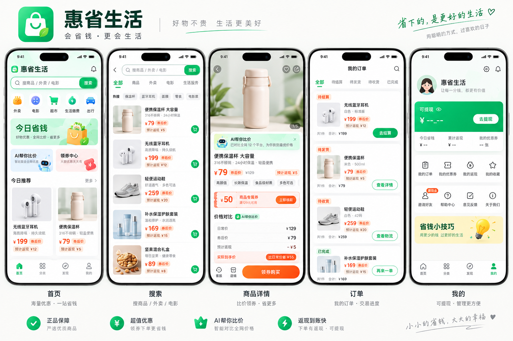
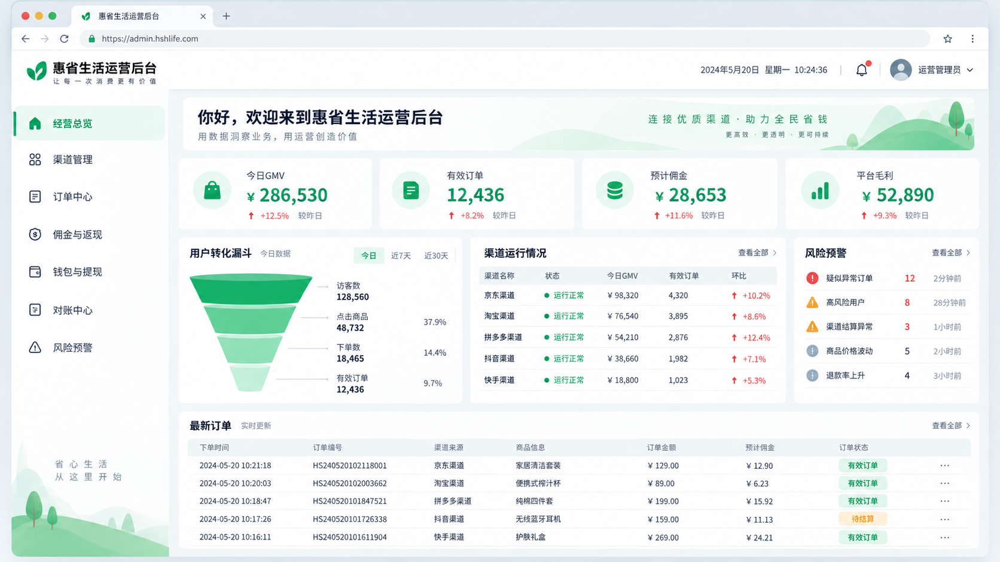
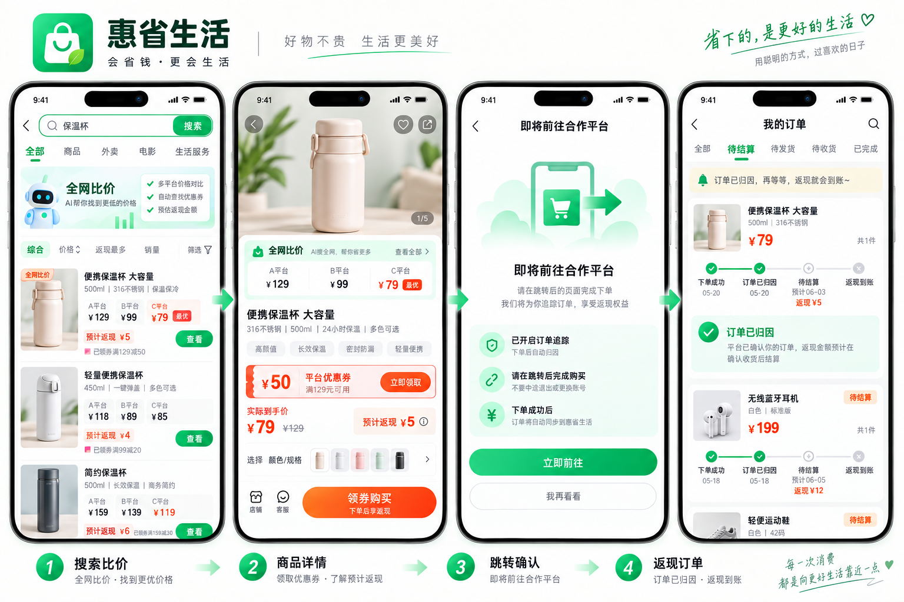
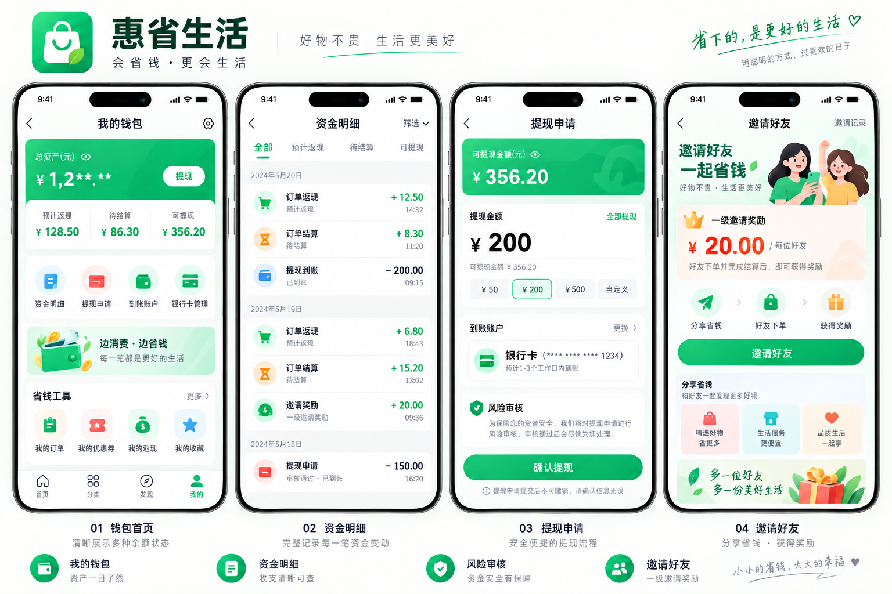
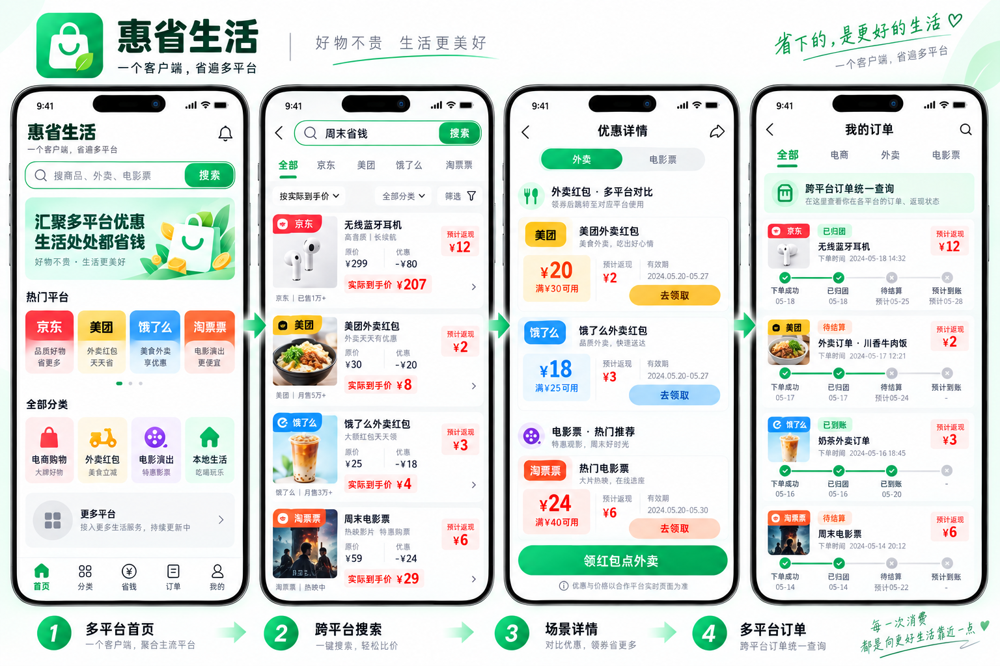
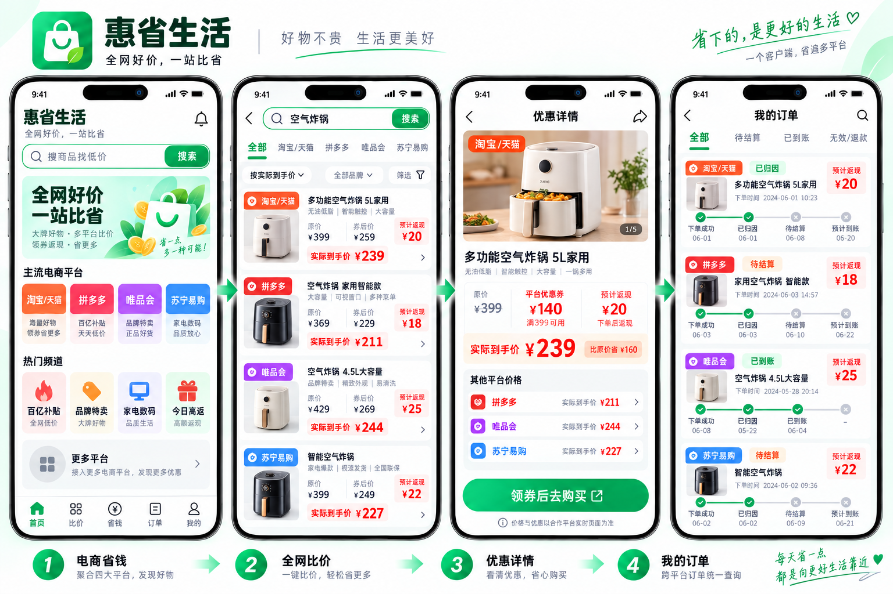
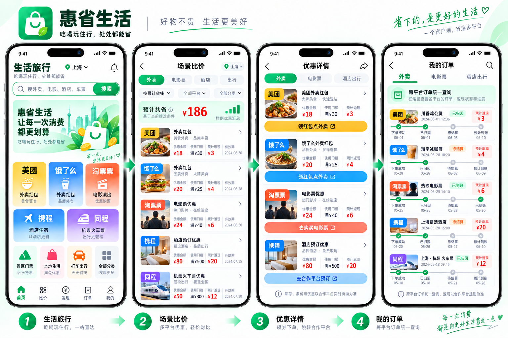

# 用户端 UI 与交互规范

## 设计图

### 用户端五屏总览

### 运营管理后台

### 购买与返现旅程

### 钱包、提现与邀请

### 多平台客户端

### 扩展电商平台

### 本地生活与旅行平台

一级导航为 `首页 / 分类 / 省钱 / 订单 / 我的`。首页包含城市、搜索、渠道入口、活动、爆款和 AI 比价入口。

客户端采用统一信息架构聚合多平台优惠，首批至少展示京东、美团、饿了么和淘票票，并为后续渠道保留“更多平台”入口。首页按 `电商购物 / 外卖红包 / 电影演出 / 本地生活` 组织场景，平台名称和识别色仅用于帮助用户辨别来源。

候选扩展渠道包括淘宝/天猫、拼多多、唯品会、苏宁易购、携程和同程。电商频道统一承载商品比价，生活旅行频道统一承载外卖、电影、酒店、机票、火车票和景区门票。设计图表示目标信息架构，不代表渠道已经获得接口、推广或返利资格；未获批渠道不得在生产环境开放入口。

- 搜索列表：支持全部或指定平台筛选；统一展示平台来源、原价、优惠、预计返现、实际到手价、销量与配送，并可按实际到手价排序。
- 商品与活动详情：价格时效、优惠券、返现说明、跨平台比较、收藏与分享；根据场景显示“领券购买”“领红包点外卖”或“购买电影票”。
- 省钱中心：外卖红包、大额券、高返、新人和限时活动。
- 订单：聚合各平台订单，支持按电商、外卖和电影票筛选；按预计返现、待结算、已到账、无效/退款分组，展示渠道来源和状态解释。
- 我的：预计、待结算、可提现、累计省钱、邀请、客服和设置。

购买旅程应在离开平台前明确提示第三方成交、订单跟踪与返现规则；返现订单使用时间轴展示下单、归因、结算和到账状态。优惠与价格以合作平台实时页面为准，客户端不得暗示在惠省生活内完成第三方交易。钱包区分预计返现、待结算和可提现金额，提现需展示到账账户、处理时效与风险审核说明。邀请奖励仅设计为一级关系，不展示或暗示多级分销。

每页定义加载、空、错误、离线、权限不足、活动过期和渠道不可用状态。金额旁明确“预计/实际”和更新时间；关键操作不能只靠颜色区分。触控区域不小于 44px，并支持字体缩放。
