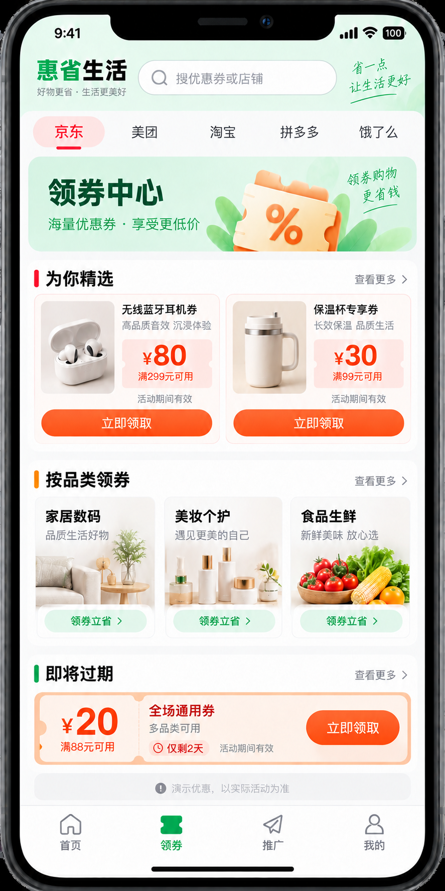
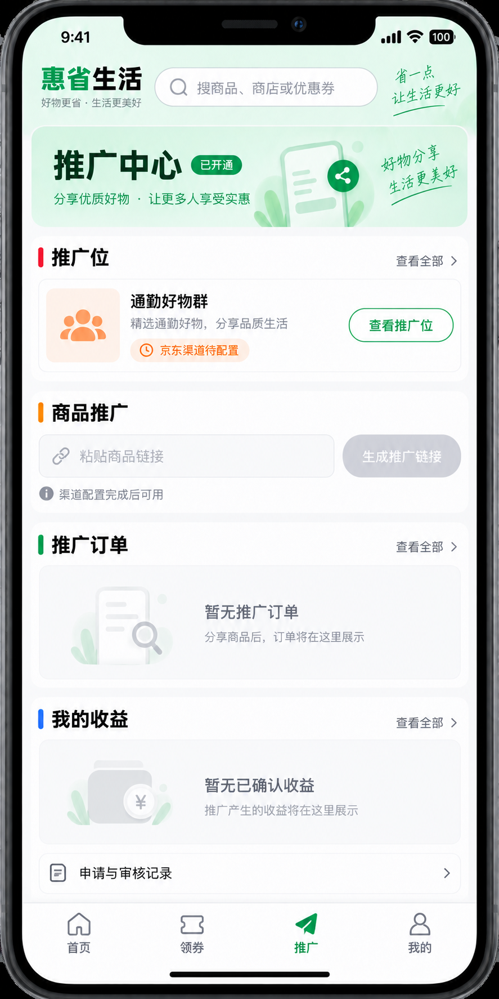

# 用户端 UI 与交互规范

当前 H5 首页方案的一级导航为 `首页 / 领券 / 推广 / 我的`。平台选择包含京东、美团、淘宝等；选择后展示该平台的推广商品、优选商店、领券中心和推广专区。下列搜索、商品详情、订单等能力仍是功能设计，不表示它们都占据底部一级导航。

- 搜索列表：平台、券后价、预计返现、实际成本、销量与配送，可按实际成本排序。
- 商品详情：价格时效、优惠券、返现说明、跨平台比较、收藏、分享与领券购买。
- 省钱中心：外卖红包、大额券、高返、新人和限时活动。
- 订单：按预计返现、待结算、已到账、无效/退款分组，展示状态解释。
- 我的：预计、待结算、可提现、累计省钱、邀请、客服和设置。

每页定义加载、空、错误、离线、权限不足、活动过期和渠道不可用状态。金额旁明确“预计/实际”和更新时间；关键操作不能只靠颜色区分。触控区域不小于 44px，并支持字体缩放。

## 首页 V3 与推广中心入口

### 多平台首页 H5 方案（V3，当前设计基线）

APP 对外显示名称定为「万宝单生活」（2026-09-17）。当前 V2/V3 概念图中的「惠省生活」属于尚未更新的历史图中文字，后续新图与实际前端标题统一使用新名称；不得仅凭旧图完成品牌验收。

2026-09-17 用户确认以此图为后续首页任务的设计基线。平台品牌（京东、美团、淘宝等）为首页一级选择；选中平台后，首页按「推广商品 / 优选商店 / 领券中心 / 推广专区」呈现该平台内容。底部固定四栏「首页 / 领券 / 推广 / 我的」；领券进入券列表，推广入口沿用登录、申请、审核、启用、停用的身份分流，我的保留推广中心次入口。平台切换只改变内容上下文，不应将未接通的平台描绘为已有真实商品、券或转链能力。模块无数据时展示明确空态与开通状态，不以演示数据填充生产页面。

底栏「领券」一级页：沿用首页平台切换，展示精选券、品类券和即将过期券；需根据真实活动返回领取状态、门槛和有效期，不可把图稿演示券当可领取数据。

点击「立即领取」后，仅在取得可信领取回执时显示「已领取 · 去使用」；「去使用」按券适用范围进入单商品详情或适用商品列表，再由商品详情确认价格 / 资格并前往平台下单。外部平台领券而结果未核实时显示待确认。完整状态、接口边界和验收见[领券到下单链路](./22-coupon-to-purchase-design.md)。

V3 券卡的主按钮由真实券能力决定：可核实本站领取为「立即领取」，平台侧领取为「前往平台领券」，商品加券物料为「领券购买」，美团等活动为「去平台领取 / 购买」。点击外跳前显示渠道、门槛和「将在平台领取并支付」；跳回后不把页面已打开画成券已到账。无可验证领取结果时提供「到平台账户确认」和查看适用范围；未获批平台显示「暂未开放」。App 唤起、H5 回退和小程序承接按实际渠道能力与终端分别设计，不将概念图上的统一「立即领取」视为所有券的固定交互。

底栏「推广」一级页：沿用四栏导航，按本人审核 / 渠道位状态显示工作台。下图为身份已启用、京东渠道位待配置状态，禁止生成转链，订单 / 收益使用空态。

推广选品二级页按平台与「商品 / 活动」双维度切换；每张卡独立预览、选择当前平台可用推广位，再生成并查询该物料的链接状态。京东 / 淘宝 / 美团不能共用未经核验的渠道参数；未获批能力保留禁用与原因。见[多平台推广界面详细设计](./23-multiplatform-promotion-ui.md)。

本图以京东选中为示例；商品、店铺、价格、券额均为虚构占位。旧版五栏「首页 / 分类 / 省钱 / 订单 / 我的」及 AI / 推广双卡图稿只保留作 V2 历史方案，不再作为 P-00 实施依据。V3 尚未完成前端实现或真实渠道验收。

V2 历史稿曾按「搜索 → 渠道快捷入口 → AI 帮我选 / 推广赚钱双卡 → 商品推荐 → 外卖红包」排列，并保留五栏底导航；不作为当前首页实施要求。推广身份分流仍见[模块设计与全部图稿](./21-promotion-center-detailed-design.md)。

H5 实现进展（M1-01a）：`/app/` 已由 Go API 同源提供，包含「万宝单生活」品牌、京东 / 美团 / 淘宝等平台切换、首页四模块和固定四栏导航。首页领券模块从 `GET /api/v1/coupons` 读取真实已核验数据；无数据、渠道未开通、加载失败分别显示状态。推广商品、商店、推广专区及登录能力仍显示未开通，不以旧图演示内容填充。当前只读 H5 不代表 M1-01、M6-04 的完整业务验收。

领券页实现进展（M6-04a）：平台切换后从同源 API 分页读取已核验券，显示优惠额、门槛、范围、有效期，并可查看详情及适用商品。空列表、未开放平台、请求失败和失效券均有明确状态。页面只有「查看规则」，领取、去使用和平台跳转尚未开放；美团当前仅展示不限城市的活动，城市选择留待 M6-04b。页面读数及操作能力仍需真实渠道物料和终端验收。

推广区 P-01～P-16 包含申请、工作台、推广位、转链分享、活动、订单、数据、结算和提现。图稿中的金额均为示例；个人预计推广收益与消费者预计返现分开，复制不等于分享送达，结算入账不等于提现。未开放渠道 / 素材类型不可表现为可交易。审核与异常状态组件仍需按[研发计划 M0](./superpowers/plans/2026-09-16-promotion-center.md)补齐。
