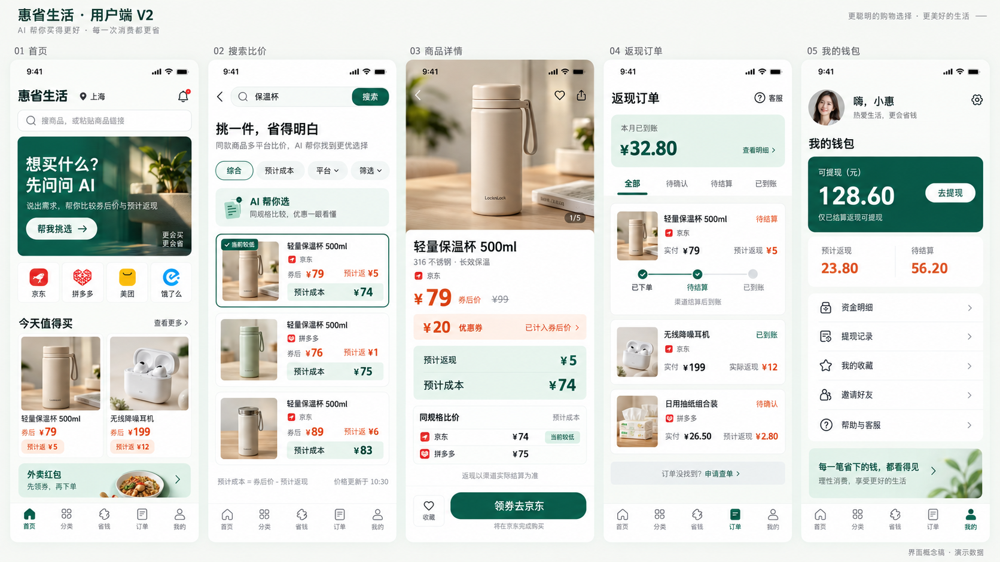

# 用户端界面重设计 V2

## 设计稿

本版为用户端高保真概念稿，覆盖首页、搜索比价、商品详情、返现订单和我的钱包。保留 V1 供比较；V2 为待评审方案，不代表已上线界面。

## 设计方向

- 暖白背景、深翠绿主操作、薄荷绿信息区，橙色用于优惠与价格。
- 增大标题、金额和操作按钮的层级差异，降低活动卡片的密度。
- 首页优先展示搜索与 AI 选购入口，四渠道入口连接商品或活动导购。
- 搜索结果统一呈现平台、券后价、预计返现与预计成本，比较时需校验同规格。
- 商品详情明确优惠券已计入券后价，购买按钮指明第三方平台。
- 返现订单使用待确认、待结算、已到账等返现状态，并显示查单入口。
- 钱包分别显示可提现、预计返现和待结算，主要操作为提现与查看资金明细。
- 一级导航沿用：首页 / 分类 / 省钱 / 订单 / 我的。

## 金额示例与交互约束

示例商品原价 99 元，优惠券 20 元，券后价 79 元，预计返现 5 元，预计成本 74 元。预计成本 = 券后价 − 预计返现，不重复减优惠券。预计成本不等于第三方平台结账时支付的金额；返现以渠道实际结算为准。

预计返现和待结算金额不可提现。订单页面中的返现状态与第三方订单履约状态分别管理。AI 比价结论与价格更新时间必须来自实际查询结果。

## 后续细化

- 分类、省钱频道、AI 对话、登录授权、提现表单和退款详情等已完成补图，见 [V2 补充界面图册](./17-user-ui-v2-gallery.md)。
- 加载、空态、网络异常、权限不足、渠道不可用与优惠过期等已纳入补充图册；组件级交互和校验细节仍需开发规格细化。
- 以实际渠道权限控制入口；成稿中的图标与商品图为视觉参考，开发时替换成已确认素材。
- 生成图片中的“当前较低”等表述，落地时限定为已查询渠道、相同规格和当次更新时间。
- 实际开发以组件和交互规格为准，图片不充当接口或状态机定义。

## 生成记录

使用内置 imagegen 工具生成，经查看确认五屏布局及主要金额、返现状态。完整提示词见 [生成提示词](./images/mobile-ui-overview-v2.prompt.md)。数据均为演示数据。
