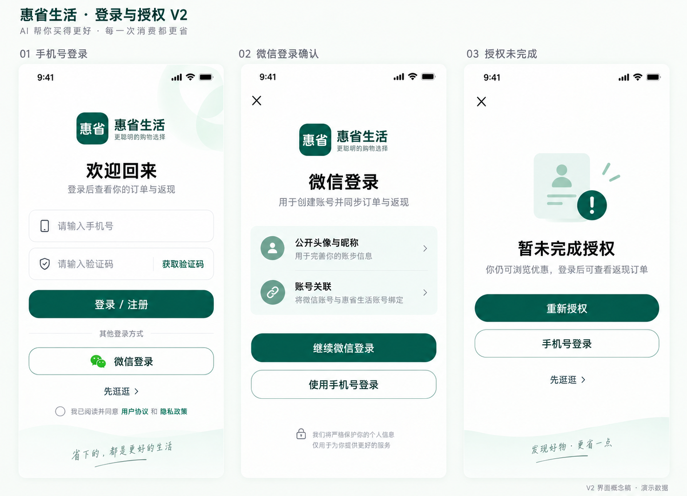
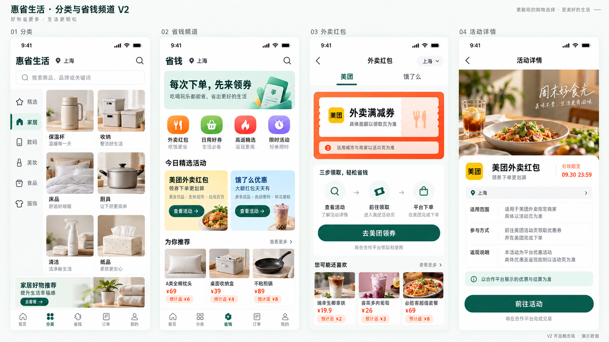
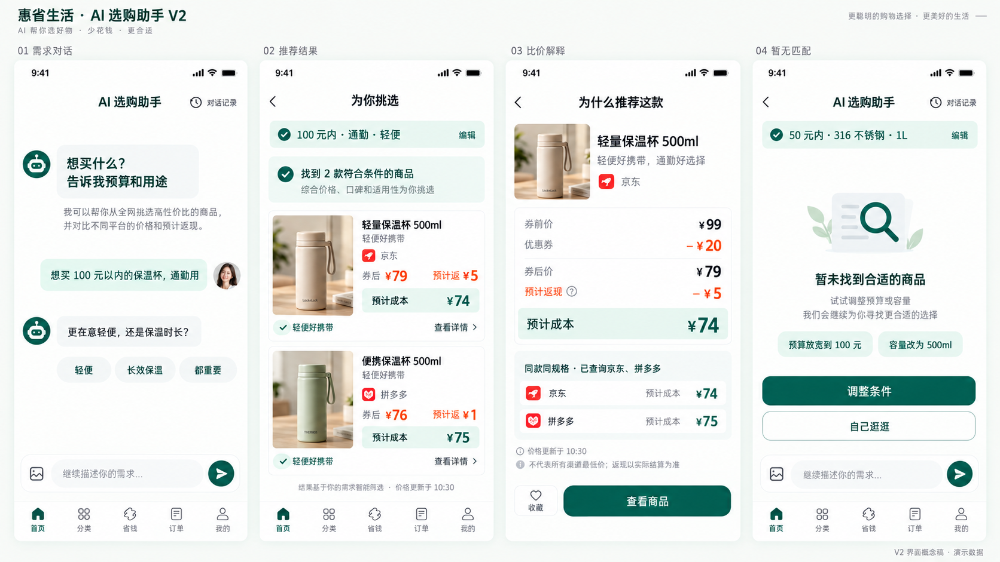
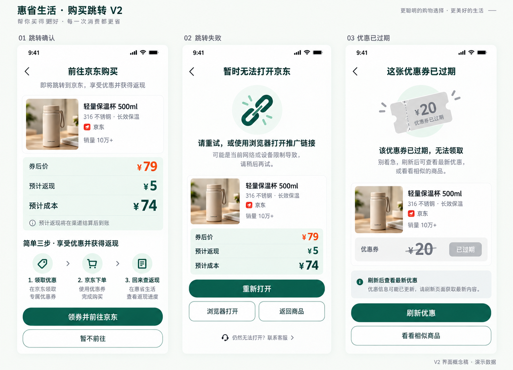
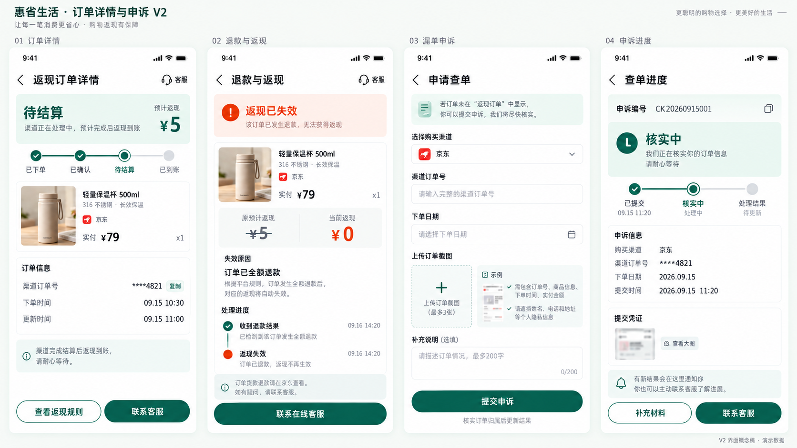
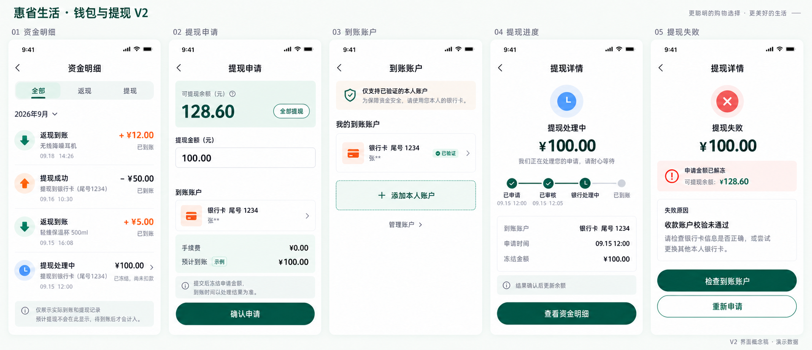
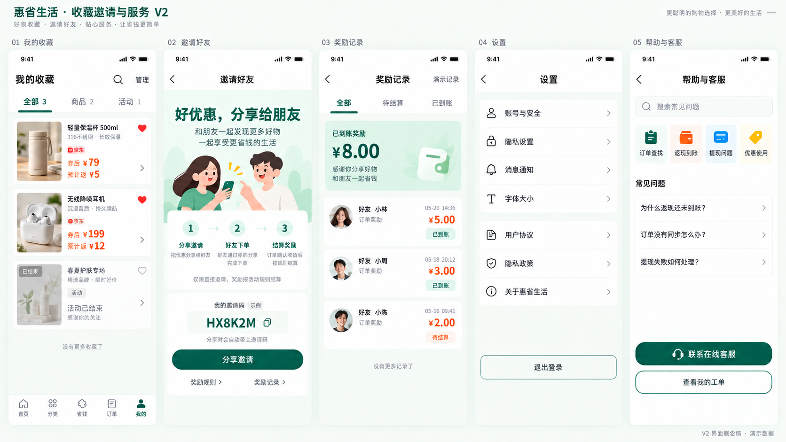
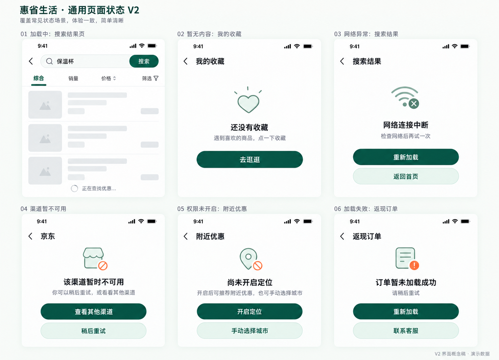

# 用户端 V2 补充界面图册

后续已补齐 V1 的多平台、扩展电商、生活旅行及运营后台画面，见 [覆盖核对与新图册](./18-v1-to-v2-design-coverage.md)。

本次新增 8 组设计图，共 34 个页面与状态；与[核心五屏](./16-user-ui-redesign-v2.md)配套查看。采用相同的暖白、深翠绿和薄荷绿风格。所有图片为高保真界面概念稿，数据为演示数据。

## 页面索引

| 图组 | 页面与状态 | 数量 |
| --- | --- | --- |
| [登录与授权](./images/user-ui-auth-v2.png) | 手机号登录、微信登录确认、授权未完成 | 3 |
| [分类与省钱频道](./images/user-ui-discovery-v2.png) | 分类、省钱频道、外卖红包、活动详情 | 4 |
| [AI 选购助手](./images/user-ui-ai-v2.png) | 需求对话、推荐结果、比价解释、暂无匹配 | 4 |
| [购买跳转](./images/user-ui-purchase-v2.png) | 跳转确认、跳转失败、优惠已过期 | 3 |
| [订单详情与申诉](./images/user-ui-orders-v2.png) | 订单详情、退款与返现、漏单申诉、申诉进度 | 4 |
| [钱包与提现](./images/user-ui-wallet-v2.png) | 资金明细、提现申请、到账账户、提现进度、提现失败 | 5 |
| [收藏邀请与服务](./images/user-ui-profile-v2.png) | 我的收藏、邀请好友、奖励记录、设置、帮助与客服 | 5 |
| [通用页面状态](./images/user-ui-states-v2.png) | 加载中、暂无内容、网络异常、渠道暂不可用、权限未开启、加载失败 | 6 |

## 评审与开发说明

- 逐组检查了页面数量、布局、关键操作与金额状态。钱包组已修正商品与返现金额的对应关系，并移除未确认的最低提现门槛；收藏组已修正筛选标签与查看详情入口。
- 提现 100 元的示例：申请前可提现 128.60 元；提交后冻结 100 元；确定失败后解冻，可提现恢复为 128.60 元。网络超时不等于提现失败，不能据此解冻。
- 券后 79 元、预计返现 5 元的商品，预计成本为 74 元。已退款而从未入账的返现按失效处理，不产生钱包扣款。
- 图中费用、活动、时间、账户尾号与奖励金额均为示例；实际规则由已确认业务配置提供。图片中的商品标识和照片仅作视觉参考。
- 生成稿中的宣传文字及辅助文案仍需产品定稿，例如 AI 查询范围应写明已接入渠道，不将“全网”等生成措辞作为能力承诺。
- 这批图覆盖本轮列出的页面与状态；表单校验、弹窗、不同终端适配等组件细节仍在开发规格阶段细化。导航最终遵循核心规格，二级流程可隐藏底部导航，不能仅按图片像素反推交互逻辑。
- 生成方式：内置 imagegen，以用户端 V2 五屏作为风格参考；[完整提示词及修正记录](./images/user-ui-supplement-v2.prompts.md)。

## 1. 登录与授权

最新登录流程采用 V3：[手机号登录](./images/user-ui-login-simple-v3.png)及[微信登录与登录未完成](./images/user-ui-auth-companion-simple-v3.png)。下方 V2 保留作为历史参考。

手机号登录、微信登录确认、授权未完成。

## 2. 分类与省钱频道

分类、省钱频道、外卖红包、活动详情。

## 3. AI 选购助手

需求对话、推荐结果、比价解释、暂无匹配。

## 4. 购买跳转

跳转确认、跳转失败、优惠已过期。

## 5. 订单详情与申诉

订单详情、退款与返现、漏单申诉、申诉进度。

## 6. 钱包与提现

资金明细、提现申请、到账账户、提现进度、提现失败。

## 7. 收藏邀请与服务

我的收藏、邀请好友、奖励记录、设置、帮助与客服。

## 8. 通用页面状态

加载中、暂无内容、网络异常、渠道暂不可用、权限未开启、加载失败。

