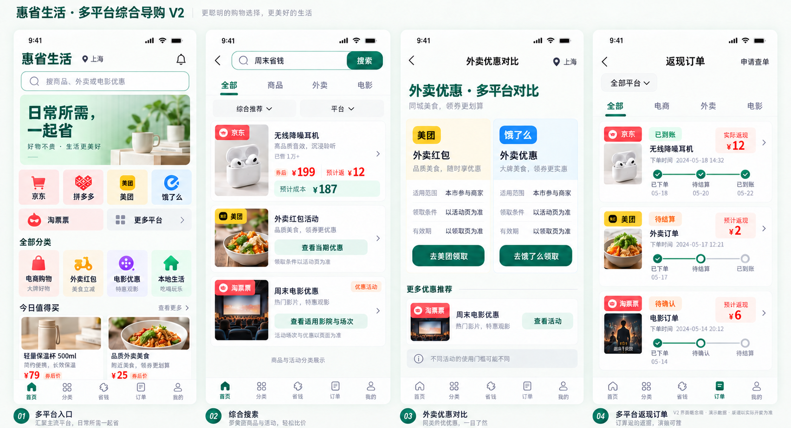
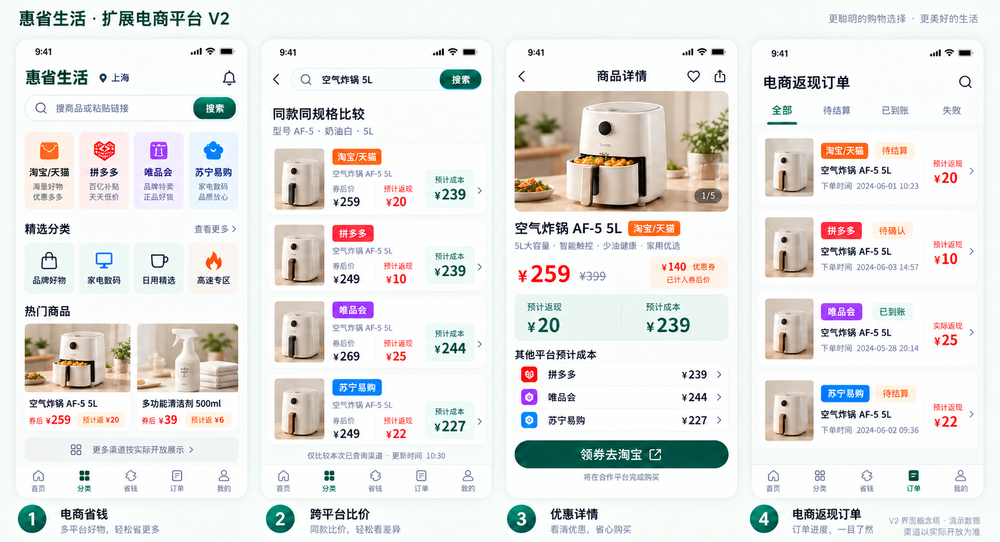
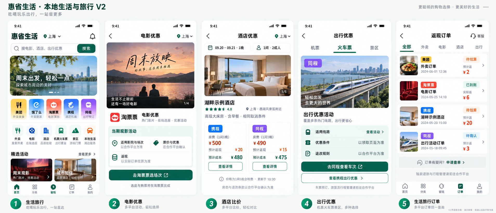
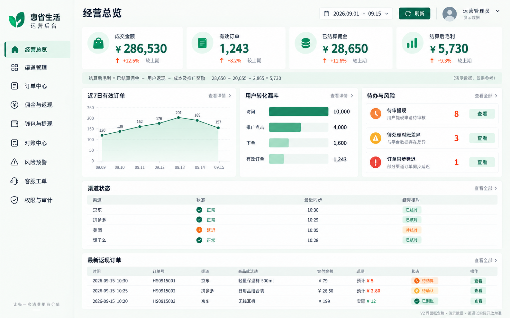

# V1 → V2 设计覆盖核对与补绘

本轮逐张核对仓库中的 7 张 V1 设计图，补绘此前未覆盖的 4 组、14 个界面。下表按原图已经展示的页面与场景核对，不将菜单入口当作已存在的独立设计页。覆盖完成指界面概念稿完成，不代表渠道已经接入或页面已经开发。

## V1 → V2 对照

| V1 原图 | 原图展示内容 | V2 对应设计 | 结果 |
| --- | --- | --- | --- |
| [用户端五屏](./images/mobile-ui-overview-v1.png) | 首页、搜索、详情、订单、我的 | [V2 核心五屏](./images/mobile-ui-overview-v2.png)、[个人中心](./images/user-ui-profile-v2.png) | 已覆盖 |
| [购买与返现旅程](./images/purchase-cashback-journey-v1.png) | 比价、详情、跳转、返现订单 | [V2 核心五屏](./images/mobile-ui-overview-v2.png)、[购买跳转](./images/user-ui-purchase-v2.png)、[订单详情](./images/user-ui-orders-v2.png) | 已覆盖 |
| [钱包与邀请](./images/wallet-withdrawal-referral-v1.png) | 钱包、明细、提现、邀请 | [钱包提现](./images/user-ui-wallet-v2.png)、[邀请与奖励](./images/user-ui-profile-v2.png)、[钱包首页](./images/mobile-ui-overview-v2.png) | 已覆盖 |
| [多平台客户端](./images/multi-platform-client-overview-v1.png) | 多平台入口、混合搜索、场景优惠、多平台订单 | [多平台综合导购 V2](./images/multi-platform-client-overview-v2.png) | 本轮补齐 4 屏 |
| [扩展电商](./images/expanded-ecommerce-platforms-v1.png) | 淘宝/天猫、拼多多、唯品会、苏宁易购的频道、比价、详情、订单 | [扩展电商 V2](./images/expanded-ecommerce-platforms-v2.png) | 本轮补齐 4 屏 |
| [生活旅行](./images/local-life-travel-platforms-v1.png) | 生活旅行入口、场景比较、优惠详情、混合订单 | [生活旅行 V2](./images/local-life-travel-platforms-v2.png)、[外卖对比](./images/multi-platform-client-overview-v2.png) | 本轮补齐 5 屏，拆分电影、酒店、出行场景 |
| [运营后台](./images/admin-dashboard-overview-v1.png) | 指标、漏斗、渠道状态、风险、订单表 | [运营后台 V2](./images/admin-dashboard-overview-v2.png) | 本轮补齐 1 屏 |

## 本轮设计取舍

- 保留 V1 展示的多平台场景，同时采用 V2 的暖白、翠绿和清晰金额层级。此前确认的简化登录 V3 继续有效。
- 电商比较限定为示例同款同规格；不同品类的商品、外卖活动和电影优惠分类呈现，不做无意义的统一价格排序。
- 外卖红包按渠道展示领取条件与适用范围，不把不同门槛的优惠面额直接相加。
- 酒店按相同日期、房型、早餐、取消条件及含税价格口径比较。示例：500 − 20 = 480 元；490 − 15 = 475 元。
- 电影页明确到合作平台选场次；机票、火车票和景区由出行频道引导到合作平台。图稿不新增站内选座出票或站内预订能力。
- 订单清楚区分预计返现和实际返现；多平台图的已到账进度已修正为完成状态。
- 后台保留原有经营总览内容，示例毛利 28,650 − 20,055 − 2,865 = 5,730 元；展示待办和审计入口，不设置直接修改余额操作。

## 交付与验证

4 张新图均已查看，核对屏数、关键金额、渠道场景及订单状态；电商比价首行的“预计成本”标签与跨平台订单进度经过局部修正。平台标识、图片、日期及宣传辅助文字仍为概念稿素材，开发时以确认的组件、素材与业务文案为准。

本轮没有为 V1 仅有菜单、图标入口而无独立画面的功能虚报设计完成，例如后台侧栏各模块详情、个人中心优惠券入口等。本表仅声明对原有实际画面的场景覆盖。

生成方式为内置 imagegen；以各组 V1 为内容参考、V2 核心五屏为风格参考。[完整提示词及修正记录](./images/v1-to-v2-completion.prompts.md)。

## 1. 多平台综合导购

多平台入口、综合搜索、外卖优惠对比、多平台返现订单。

## 2. 扩展电商平台

扩展电商频道、同款跨平台比价、优惠详情、电商返现订单。

## 3. 本地生活与旅行

生活旅行频道、电影优惠、酒店比价、出行优惠、生活旅行订单。

## 4. 运营后台总览

经营指标、有效订单趋势、转化漏斗、待办风险、渠道状态与最新订单。

