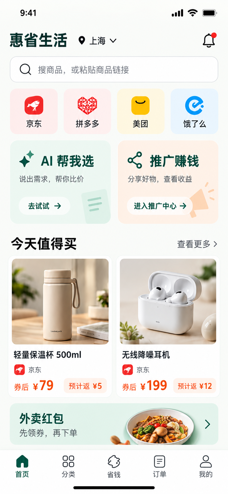
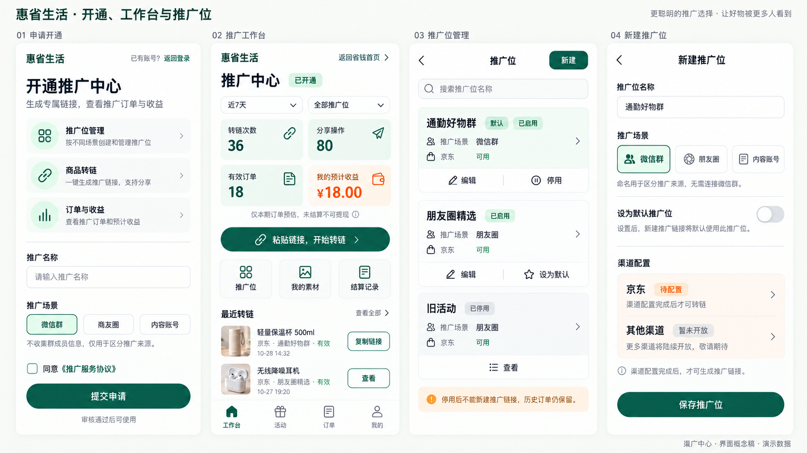
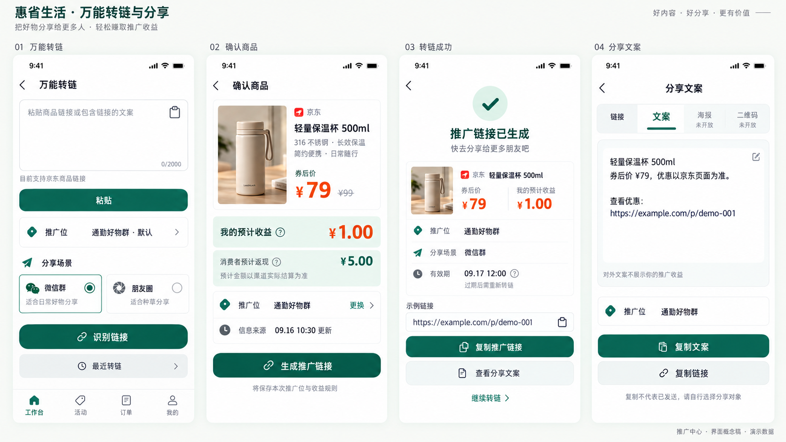
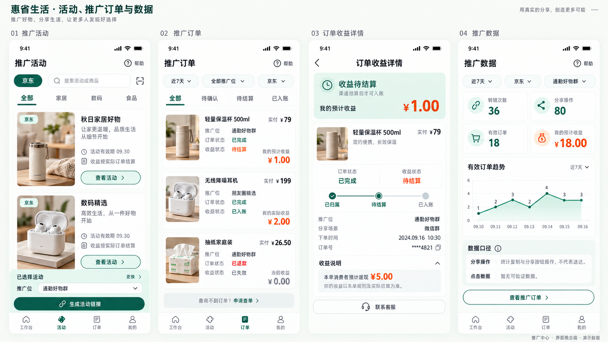
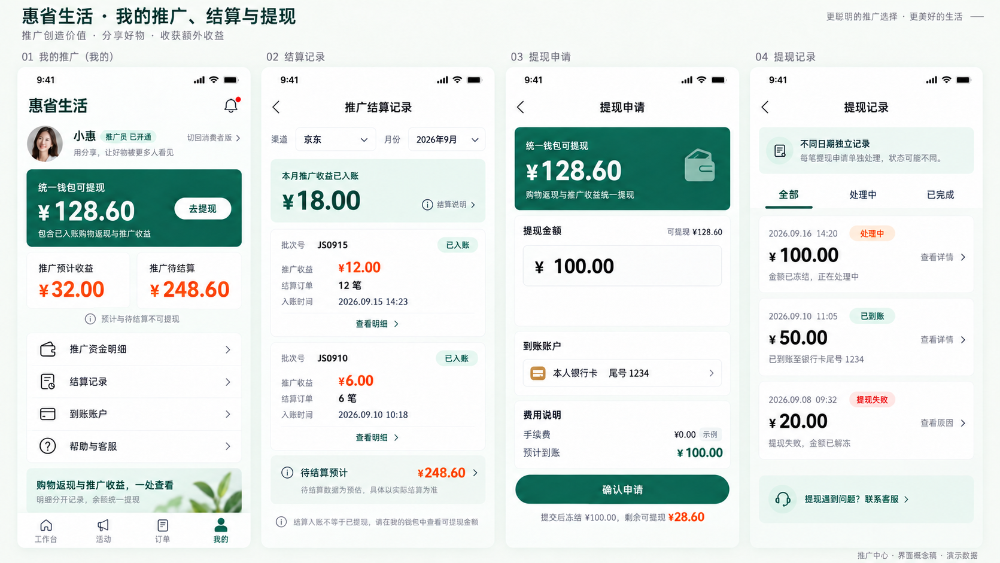

# 推广中心详细设计（含首页入口与 V2 图）

版本：2026-09-16。状态：研发设计，未代表功能已上线。业务来源为仓库内[万单宝式模型](./万单宝模型功能.md)，分析与视觉说明见[用户端方案](./20-promoter-model-user-ui-design.md)。本文统一接口、数据、交互与验收边界；执行任务见[推广中心研发计划](./superpowers/plans/2026-09-16-promotion-center.md)。

## 1. 范围与产品入口

面向普通用户申请成为推广员后的一级推广场景：申请 → 推广位 → 商品识别 → 转链分享 → 订单归因 → 推广收益 → 结算 → 统一钱包提现。首期只接京东已获批能力；其他渠道、团队、多级奖励、海报编辑器不纳入首期。活动页 P-09 延后至活动接口可用。

首页在渠道快捷入口下方、商品推荐上方，以双卡并列展示「AI 帮我选 / 推广赚钱」。推广卡文案「分享好物，查看收益」，按钮「进入推广中心」；不展示保证收益。保留原有五个底部导航，不增加第六个入口。「我的 → 推广中心」作为常驻次入口。

| 用户状态 | 点击入口后的行为 | 服务端权限 |
| --- | --- | --- |
| 未登录 | 复用简化登录，登录后恢复站内目标页 | 禁止访问个人推广数据 |
| 未申请 / 审核拒绝 | P-01 申请 / 原因与重新申请 | 仅状态和本人申请 |
| 审核中 | 申请进度与客服 | 不允许转链 |
| 已启用 | P-02 工作台 | 本人推广位、链接、订单及收益 |
| 已停用 | 停用原因与历史记录入口 | 禁止新转链；本人历史账务可读，提现仍按钱包风控规则 |

回跳目标仅允许站内白名单，不接受任意外部 URL。前端隐藏按钮不能替代服务端鉴权。

## 2. 页面、功能与图稿

以下路径为待实现的逻辑路由，不表示已有前端工程。推广区内导航为工作台、活动、订单、我的；活动未开放时不提供可操作入口。

| 编号 | 页面 / 路由 | 核心行为 | 研发批次 |
| --- | --- | --- | --- |
| P-00 | 首页 / | 推广卡、身份分流、回跳 | M1 |
| P-01 | 申请 /promoter/apply | 场景、协议版本、提交与审核状态 | M1 |
| P-02 | 工作台 /promoter | 转链入口、推广位筛选、近期链接 | M1 骨架，M3 数据 |
| P-03 | 推广位 /promoter/positions | 列表、默认、编辑、停用 | M1 |
| P-04 | 新建推广位 /promoter/positions/new | 名称、场景、渠道配置状态 | M1 |
| P-05 | 万能转链 /promoter/convert | 主动粘贴、选推广位、识别 | M2 |
| P-06 | 确认商品 /promoter/preview/:id | 时效、券后价、个人预计收益、消费者预计返现 | M2 |
| P-07 | 转链结果 /promoter/links/:id | 链接、有效期、推广位与复制 | M2 |
| P-08 | 分享内容 /promoter/links/:id/share | 链接和文案，不公开个人收益 | M2 |
| P-09 | 活动 /promoter/activities | 活动有效期、推广位、活动转链 | M5 |
| P-10 | 推广订单 /promoter/orders | 日期 / 渠道 / 推广位 / 状态筛选 | M3 |
| P-11 | 收益详情 /promoter/orders/:id | 交易状态与收益状态分离、归因说明 | M3 |
| P-12 | 数据 /promoter/analytics | 转链、分享操作、有效订单、预计收益 | M3 |
| P-13 | 我的推广 /promoter/me | 推广身份、分来源收益、统一钱包入口 | M4 |
| P-14 | 结算 /promoter/settlements | 批次、待结算、已入账与明细 | M4 |
| P-15 | 提现 /wallet/withdraw | 复用钱包、提交即冻结 | M4 |
| P-16 | 提现记录 /wallet/withdrawals | 处理中 / 成功 / 失败与解冻 | M4 |

### 2.1 申请、工作台与推广位（P-01～P-04）

### 2.2 识别、转链与分享（P-05～P-08）

### 2.3 活动、订单与数据（P-09～P-12）

### 2.4 推广资产、结算与提现（P-13～P-16）

图中金额、订单、链接均为演示数据，不作为生产默认值。现有图覆盖首页与 16 个核心页面，不代表所有状态已绘制：审核中、拒绝、停用、无推广位、渠道待配置、价格变动、过期、空数据、失败重试需补充状态组件；审核后台和团队页尚未绘制。交付前完成对应状态稿和交互验收。

## 3. 接口契约

以下为新增目标契约，统一前缀 `/api/v1`，不是现有接口清单。鉴权、分页及响应封装遵循[API 规范](./01-api-spec.md)。金额对外使用十进制定点字符串及 currency，内部按最小货币单位整数处理；拒绝客户端上传的佣金、返现或余额作为结算依据。

| 接口 | 输入 / 查询 | 输出与约束 |
| --- | --- | --- |
| GET /promoter/profile | 当前身份 | status、reason、capabilities、applicationId |
| POST /promoter/applications | displayName、scene、agreementVersion | applicationId、PENDING；保存同意时间，重复提交幂等 |
| GET /promoter/applications/current | 本人 | 审核进度、原因、可否重提 |
| GET /promotion-positions | cursor、status | 本人推广位与各渠道 readiness |
| POST /promotion-positions | name、scene、isDefault | 内部推广位；不承诺渠道配置即刻完成 |
| PATCH /promotion-positions/{id} | name、scene、version | 乐观锁冲突 409，仅本人 |
| POST /promotion-positions/{id}/default | version | 原默认与新默认同事务变更 |
| POST /promotion-positions/{id}/disable | version | 停止新转链，保留历史关联 |
| POST /promotions/preview | input、positionId、scene | previewId、商品、价格 / 收益估算、updatedAt、expiresAt；不创建推广链接 |
| POST /promotions/convert | previewId、positionId、scene | trackingId、linkId、status；完成返回链接，处理中返回 202 与状态查询地址 |
| GET /promotion-links/{id} | 本人 | PROCESSING / READY / FAILED / EXPIRED、跳转地址与到期时间 |
| GET /promotion-links/{id}/share-artifacts | type=link/text | 公开文案和链接，不含个人收益；未开放素材类型拒绝 |
| POST /promotion-links/{id}/share-events | eventId、action、scene | 去重记操作，不宣称送达，不触发收益 |
| GET /promoter/orders | cursor、from、to、channel、positionId、orderStatus、earningStatus | 脱敏订单与独立状态 |
| GET /promoter/orders/{id} | 本人归因订单 | 归因证据摘要、规则版本、金额和状态历史 |
| GET /promoter/dashboard | from、to、channel、positionId | 指标、时区、数据截止时间；无数据返回 0 或未接入说明 |
| GET /promoter/earnings | cursor、status、from、to | 个人收益记录，不是渠道总佣金 |
| GET /promoter/settlements | cursor、status | 批次、已入账和待结算分列 |
| GET /promoter/settlements/{id} | 本人 | 本人在批次中的订单、调整与流水关联 |
| GET /wallet、POST /withdrawals | 沿用钱包契约 | 同人同币种统一钱包，不新建重复提现通道 |
| GET /withdrawals、GET /withdrawals/{id} | cursor / 本人记录 | 冻结、付款、失败解冻状态 |
| GET /promoter/activities | channel、cursor | M5：仅有效且已授权活动 |

新增后台 `/admin/v1/promoter-applications` 列表与 `/{id}/review` 审核（POST）、`/promoters/{id}/disable`（POST），要求权限、reason、version、审计记录；渠道映射配置复用渠道管理员权限，不允许推广员直接填写外部账户归属。

所有写操作要求 Idempotency-Key（分享事件另外以 eventId 去重）。相同身份、操作、键及规范化输入返回同一结果，不同输入返回 409。旧 `POST /promotions/link` 保留购物导购用途；新接口复用领域服务，不以客户端指定 promoterId 绕过身份授权。

业务错误包括 PROMOTER_NOT_ENABLED、POSITION_NOT_READY、UNSUPPORTED_CHANNEL、PREVIEW_EXPIRED、PRICE_CHANGED、IDEMPOTENCY_CONFLICT、CHANNEL_UNAVAILABLE。过期或价格 / 规则变化应重新预览确认；越权对象返回不泄露资源存在性的错误。上游错误仅保存脱敏诊断，不原样返回。

## 4. 数据与状态

| 实体 | 关键字段 / 约束 |
| --- | --- |
| promoter_profiles | user_id 唯一、status、version、停用原因 |
| promoter_applications | user_id、scene、agreement_version、consented_at、reviewer、review_reason；同人最多一份待审申请 |
| promotion_positions | owner_user_id、name、scene、status、is_default、version；每人最多一个启用默认位，停用默认位需清除默认 |
| channel_positions | 内部推广位、channel_id、account_id、external_position_id、readiness；外部标识按渠道规则约束，不单凭共享标识认定个人归属 |
| promotion_previews | owner、解析后的商品、估算规则版本、position_id、expires_at；短期保存，不是最终资金凭证 |
| tracking_records / promotion_links | 新增 promoter_user_id、position_id、scene、preview_id、请求指纹、处理状态、渠道请求号；历史关联不可随推广位修改而漂移 |
| share_artifacts / share_records | link_id、类型 / 文案版本；事件 event_id、操作者、操作、时间；不含收件人通讯录 |
| promoter_earning_records | order_id、beneficiary_id、rule_snapshot_id、currency、预计 / 实际金额、状态；业务奖励类型唯一键防重复 |
| settlement_batches / settlement_items | 渠道结算证据、周期、状态；收益记录及调整唯一关联，重复结算不重复入账 |
| wallet_transactions | 增加来源 SHOPPING_CASHBACK / PROMOTION_REWARD / REFERRAL_REWARD，关联收益、批次、冲正原流水 |

以上为目标模型，需要新增迁移；现有 Tracking 迁移不等于已支持这些字段。新增归属字段须兼容历史购物 Tracking，不可直接给旧记录补造推广员。索引覆盖本人 + 时间、推广位 + 时间、订单收益状态、批次明细与幂等键。

推广员：未申请 → PENDING → ENABLED / REJECTED；REJECTED 可重新申请，ENABLED 可被 DISABLED。恢复资格须有审核和审计，不由客户端变更。

交易状态沿用[订单状态机](./07-order-state-machine.md)。推广收益沿用[佣金钱包状态](./08-commission-wallet.md)：ESTIMATED → PENDING_CONFIRM → PENDING_SETTLEMENT → AVAILABLE；失效为 INVALID，到账后冲正为 CLAWED_BACK。统一钱包提现后不简单把某笔推广收益改成 WITHDRAWN；如需分来源提现报表，另建提现分摊明细。

## 5. 核心执行与安全

1. 输入识别：用户主动粘贴，服务端仅接受授权渠道链接 / 口令；限制协议、端口、响应大小、超时及跳转次数。每次重定向重新校验域名和解析地址，阻断内网、环回、链路本地地址与 DNS 重绑定风险。

研发进展（2026-09-16）：已落地精确域名白名单、HTTPS / 443 与地址安全判定代码。真实京东可用域名待正式渠道能力确认并配置；当前代码只提供校验边界，HTTP 展开及只读商品预览仍在研发任务中。
2. 预览：校验推广身份和推广位配置，返回商品与估算，不创建可分享链接；不把客户端传回的价格当真实渠道数据。
3. 转链：重新校验预览有效期、身份、推广位、商品价格与规则；先持久化幂等请求与 Tracking，再调用渠道。超时标记处理中并按渠道查询 / 幂等能力恢复，不盲目重发制造重复链接。推广位变更必须创建新请求。
4. 分享：所有文案复用同一 Tracking；复制成功才记录复制操作，取消分享不报送达。公开文案隐藏个人收益及消费者隐私。
5. 订单：原始数据留存 → 标准化幂等 → 精确归因；优先可信 subId、独立渠道位、唯一链接凭证，再走审核申诉。不按时间 / 金额猜测归属。推广者可识别不等于匿名购买者也可识别。
6. 资金：订单建立时冻结规则快照；迟到订单无历史规则依据时进入待核验，不拿当前比例回算。渠道确认和结算后才产生可用收益；账本、余额与 Outbox 同事务，重复消息不重复入账。
7. 退款：未入账调整预计 / 待结算；已入账追加冲正，部分退款按快照重算差额，禁止删除原账。已提现且余额不足的追偿策略确认前转人工风险处理，不擅自扣外部账户。

数据看板统一 Asia/Shanghai 日界限，响应包含统计时区和截止时间。转链数按成功 linkId 去重，分享操作按 eventId 去重，有效订单排除无效及全额退款并按 orderId 去重；预计收益展示范围内未失效订单当前预计推广奖励，实际到账另列。没有可靠点击采集时不显示转化率。

## 6. 资金边界与待确认决策

建议同人同币种统一可提现钱包，以流水来源区分购物返现、推广奖励、邀请奖励。图中消费者返现与推广员收益不可合并展示，也不能以渠道总佣金充当个人收益。最终资金规则须产品 / 财务签字后实施。

| 决策 | 当前设计 / 上线门槛 |
| --- | --- |
| 同人既购买又推广 | 互斥还是叠加及优先级待确认；未确认不开放对应奖励结算 |
| 匿名购买者返现 | 无法验证消费者身份时不自动发消费者返现；推广奖励仍需独立可信归因 |
| 统一钱包 | 作为 UI 和接口设计方案；需要迁移、对账与财务确认，不重复计入现有余额 |
| 到账后退款且余额不足 | 追偿、风险冻结与用户说明待确认；不得默认为丢弃差额或直接外部扣款 |
| 推广位停用后的旧链接 | 停止新建、保留历史；旧链接继续有效与否遵循渠道能力和已确认政策 |
| 提现费率 / 门槛 / 到账时间 | 由实际支付能力和财务规则配置，图中示例不作为承诺 |

## 7. 验收与交付

首页入口 → 登录 / 审核分流 → 已启用推广位 → 京东预览 → 转链分享 → 可验证订单归因 → 收益确认 → 渠道结算 → 统一钱包 → 提现 / 退款对账必须分别留存证据。详情与测试清单见[研发计划](./superpowers/plans/2026-09-16-promotion-center.md)。只有图稿或模拟接口通过，不得标记真实渠道闭环完成。
