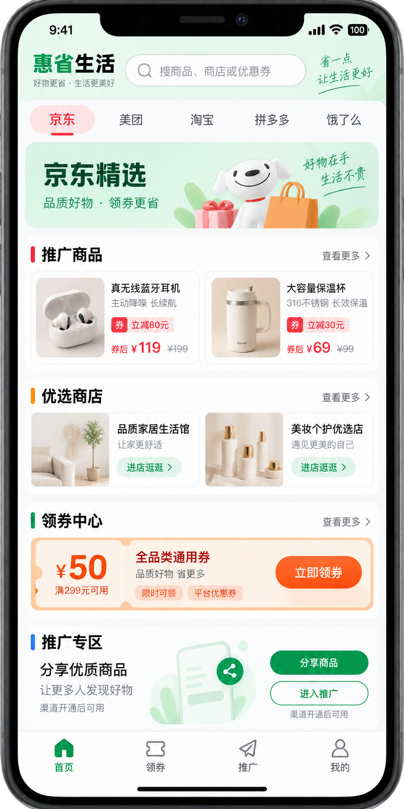
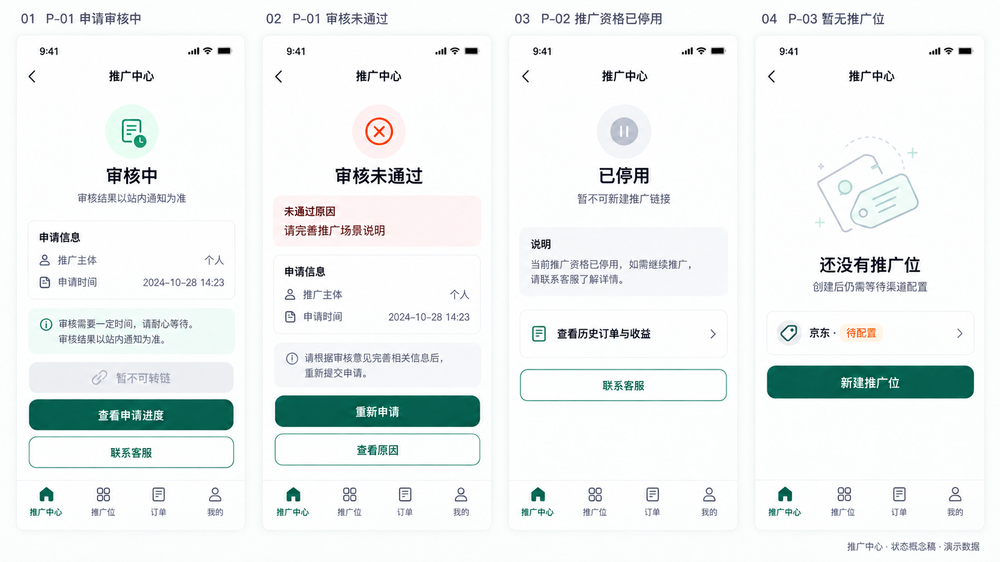
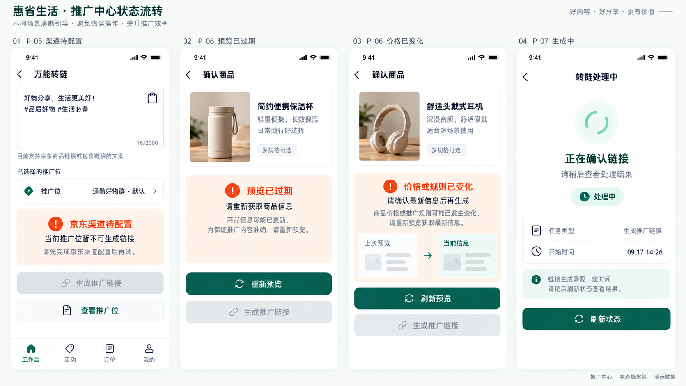
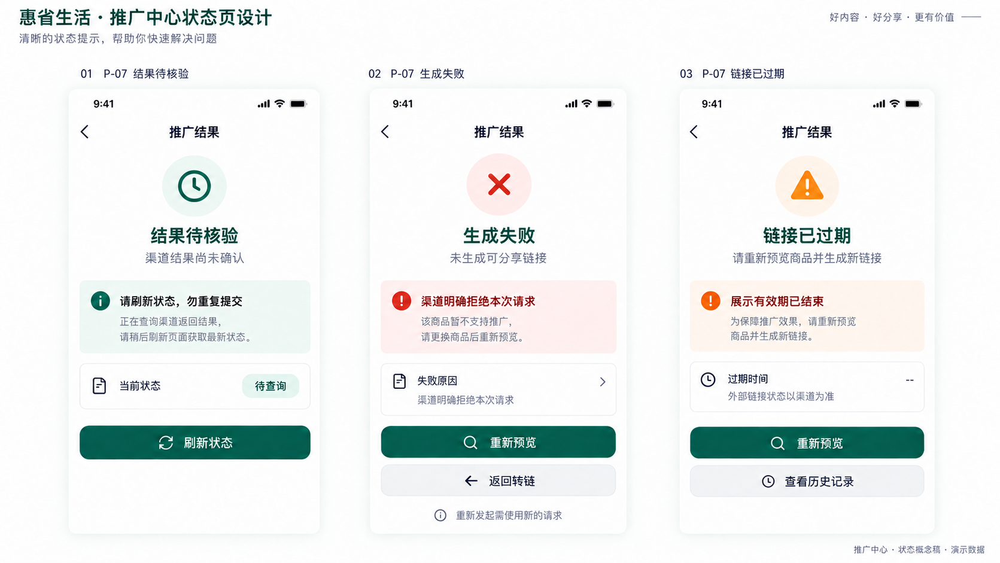

# 推广中心详细设计（含首页入口与 V2 图）

版本：2026-09-16。状态：研发设计，未代表功能已上线。业务来源为仓库内[万单宝式模型](./万单宝模型功能.md)，分析与视觉说明见[用户端方案](./20-promoter-model-user-ui-design.md)。本文统一接口、数据、交互与验收边界；执行任务见[推广中心研发计划](./superpowers/plans/2026-09-16-promotion-center.md)。

## 1. 范围与产品入口

面向普通用户申请成为推广员后的一级推广场景：申请 → 推广位 → 商品识别 → 转链分享 → 订单归因 → 推广收益 → 结算 → 统一钱包提现。首期只接京东已获批能力；其他渠道、团队、多级奖励、海报编辑器不纳入首期。活动页 P-09 延后至活动接口可用。

2026-09-17 增量设计：多平台商品 / 活动选品与逐物料推广链接见[推广界面 V3 详细设计](./23-multiplatform-promotion-ui.md)。这是后续扩展蓝图，不改变上述首期真实能力边界；淘宝、美团以及京东活动均需独立获批与验收。

P-00 首页按已确认的 [H5 V3 多平台图稿](./images/home-platform-modules-h5-v3.png)实施：选择京东、美团、淘宝等平台后，分区显示该平台的推广商品、优选商店、领券中心、推广专区；底部固定「首页 / 领券 / 推广 / 我的」四栏。首页推广专区、底部推广及「我的 → 推广中心」入口复用下表身份分流；未接通渠道展示不可用 / 空态，不展示图稿中的演示价格、券或可用转链。首期真实渠道能力仍限获批京东。

旧版「AI 帮我选 / 推广赚钱」双卡与五栏导航[图稿](./images/home-promoter-entry-v2.png)仅作历史参考，不再是 P-00 验收依据。

| 用户状态 | 点击入口后的行为 | 服务端权限 |
| --- | --- | --- |
| 未登录 | 复用简化登录，登录后恢复站内目标页 | 禁止访问个人推广数据 |
| 未申请 / 审核拒绝 | P-01 申请 / 原因与重新申请 | 仅状态和本人申请 |
| 审核中 | 申请进度与客服 | 不允许转链 |
| 已启用 | P-02 工作台 | 本人推广位、链接、订单及收益 |
| 已停用 | 停用原因与历史记录入口 | 禁止新转链；本人历史账务可读，提现仍按钱包风控规则 |

回跳目标仅允许站内白名单，不接受任意外部 URL。前端隐藏按钮不能替代服务端鉴权。

## 2. 页面、功能与图稿

以下路径为待实现的逻辑路由，不表示已有前端工程。推广区内导航为工作台、活动、订单、我的；活动未开放时不提供可操作入口。

| 编号 | 页面 / 路由 | 核心行为 | 研发批次 |
| --- | --- | --- | --- |
| P-00 | 首页 / | 平台切换、四内容模块、四栏底导航、推广身份分流与回跳 | M1 |
| P-01 | 申请 /promoter/apply | 场景、协议版本、提交与审核状态 | M1 |
| P-02 | 工作台 /promoter | 转链入口、推广位筛选、近期链接 | M1 骨架，M3 数据 |
| P-03 | 推广位 /promoter/positions | 列表、默认、编辑、停用 | M1 |
| P-04 | 新建推广位 /promoter/positions/new | 名称、场景、渠道配置状态 | M1 |
| P-05 | 万能转链 /promoter/convert | 主动粘贴、选推广位、识别 | M2 |
| P-06 | 确认商品 /promoter/preview/:id | 时效、券后价、个人预计收益、消费者预计返现 | M2 |
| P-07 | 转链结果 /promoter/links/:id | 链接、有效期、推广位与复制 | M2 |
| P-08 | 分享内容 /promoter/links/:id/share | 链接和文案，不公开个人收益 | M2 |
| P-09 | 活动 /promoter/activities | 活动有效期、推广位、活动转链 | M5 |
| P-10 | 推广订单 /promoter/orders | 日期 / 渠道 / 推广位 / 状态筛选 | M3 |
| P-11 | 收益详情 /promoter/orders/:id | 交易状态与收益状态分离、归因说明 | M3 |
| P-12 | 数据 /promoter/analytics | 转链、分享操作、有效订单、预计收益 | M3 |
| P-13 | 我的推广 /promoter/me | 推广身份、分来源收益、统一钱包入口 | M4 |
| P-14 | 结算 /promoter/settlements | 批次、待结算、已入账与明细 | M4 |
| P-15 | 提现 /wallet/withdraw | 复用钱包、提交即冻结 | M4 |
| P-16 | 提现记录 /wallet/withdrawals | 处理中 / 成功 / 失败与解冻 | M4 |
| P-17 | 推广选品 /promoter/materials | 平台 / 商品活动切换、逐物料预览、推广位选择与链接状态 | M7；未获批渠道禁用 |

### 2.1 申请、工作台与推广位（P-01～P-04）

补充状态稿（M0-05a）：[审核中 / 拒绝 / 停用 / 无推广位](./images/promoter-states-onboarding-v2.png)。

| 状态画面 | 对应页面 | 可操作项 | 服务端边界 |
| --- | --- | --- | --- |
| 审核中 | P-01 | 查看本人申请进度、联系客服 | 不可新建推广位或转链；结果由审核接口决定 |
| 审核未通过 | P-01 | 查看用户可见原因、符合规则时重新申请 | 不显示内部审核备注；重申须新幂等键和明确协议同意 |
| 资格已停用 | P-02 | 查看历史订单与收益、联系客服 | 不可新转链；历史归属和资金记录不删除 |
| 暂无推广位 | P-03 | 新建内部推广位 | 仅建内部位不等于京东 READY，渠道待配置时不可转链 |

### 2.2 识别、转链与分享（P-05～P-08）

补充状态稿（M0-05b）：[渠道 / 预览 / 生成中](./images/promoter-states-convert-v2.png)与[结果待核验 / 确定失败 / 展示过期](./images/promoter-states-result-v2.png)。

| 状态画面 | 对应页面 | 用户可操作项 | 实现边界 |
| --- | --- | --- | --- |
| 京东渠道待配置 | P-05 | 查看推广位 | 禁用生成；内部推广位已建不等于渠道 READY |
| 预览已过期 | P-06 | 重新预览 | 不沿用已过期 previewId 或价格，生成按钮禁用 |
| 价格或规则变化 | P-06 | 刷新预览并重新确认 | 不允许以前一次估算生成；新预览绑定新请求指纹 |
| 正在确认链接 | P-07 | 刷新状态 | 只查询同一 requestId；没有成功链接时不可复制 |
| 结果待核验 | P-07 | 刷新状态 | 渠道结果不确定时按请求号查询，不盲目重发创建 |
| 明确生成失败 | P-07 | 重新预览、返回转链 | 新操作使用新幂等键；旧失败请求留存审计 |
| 展示有效期结束 | P-07 | 重新预览、查看历史 | 不断言外部链接已失效；旧链接实际行为以渠道能力与规则为准 |

### 2.3 活动、订单与数据（P-09～P-12）

### 2.4 推广资产、结算与提现（P-13～P-16）

图中金额、订单、链接均为演示数据，不作为生产默认值。现有图覆盖首页与 16 个核心页面，并补齐推广身份、推广位、渠道/预览和转链结果的关键状态；订单/看板等其他空数据与审核后台仍需补图，团队页不在首期范围。交付前完成对应状态稿和交互验收。

## 3. 接口契约

以下为新增目标契约，统一前缀 `/api/v1`，不是现有接口清单。鉴权、分页及响应封装遵循[API 规范](./01-api-spec.md)。金额对外使用十进制定点字符串及 currency，内部按最小货币单位整数处理；拒绝客户端上传的佣金、返现或余额作为结算依据。

| 接口 | 输入 / 查询 | 输出与约束 |
| --- | --- | --- |
| GET /promoter/profile | 当前身份 | status、reason、capabilities、applicationId |
| POST /promoter/applications | displayName、scene、agreementVersion | applicationId、PENDING；保存同意时间，重复提交幂等 |
| GET /promoter/applications/current | 本人 | 审核进度、原因、可否重提 |
| GET /promotion-positions | cursor、status | 本人推广位与各渠道 readiness |
| POST /promotion-positions | name、scene、isDefault | 内部推广位；不承诺渠道配置即刻完成 |
| PATCH /promotion-positions/{id} | name、scene、version | 乐观锁冲突 409，仅本人 |
| POST /promotion-positions/{id}/default | version | 原默认与新默认同事务变更 |
| POST /promotion-positions/{id}/disable | version | 停止新转链，保留历史关联 |
| POST /promotions/preview | input、positionId、scene | previewId、商品、价格 / 收益估算、updatedAt、expiresAt；不创建推广链接 |
| POST /promotions/convert | previewId、positionId、scene | trackingId、linkId、status；完成返回链接，处理中返回 202 与状态查询地址 |
| GET /promotions/convert/{id} | 本人转链请求 ID | 返回状态与 Tracking；仅 SUCCEEDED 可返回链接，未授权对象以 404 隐藏 |
| GET /promotion-links/{id} | 本人 | PROCESSING / READY / FAILED / EXPIRED、跳转地址与到期时间 |
| GET /promotion-links/{id}/share-artifacts | type=link/text | 公开文案和链接，不含个人收益；未开放素材类型拒绝 |

| POST /promotion-links/{id}/share-events | eventId、action、scene | 去重记操作，不宣称送达，不触发收益 |
| GET /promoter/orders | cursor、from、to、channel、positionId、orderStatus、earningStatus | 脱敏订单与独立状态 |
| GET /promoter/orders/{id} | 本人归因订单 | 归因证据摘要、规则版本、金额和状态历史 |

| GET /promoter/dashboard | from、to、channel、positionId | 指标、时区、数据截止时间；无数据返回 0 或未接入说明 |
| GET /promoter/earnings | cursor、status、from、to | 个人收益记录，不是渠道总佣金 |
| GET /promoter/settlements | cursor、status | 批次、已入账和待结算分列 |
| GET /promoter/settlements/{id} | 本人 | 本人在批次中的订单、调整与流水关联 |
| GET /wallet、POST /withdrawals | 沿用钱包契约 | 同人同币种统一钱包，不新建重复提现通道 |
| GET /withdrawals、GET /withdrawals/{id} | cursor / 本人记录 | 冻结、付款、失败解冻状态 |
| GET /promoter/activities | channel、cursor | M5：仅有效且已授权活动 |

分享内容实现进展（M2-06a）：实际 API 为 `GET /api/v1/promotions/convert/{id}/share-artifacts?type=link|text`，只对已验签的本人且转链状态为 `SUCCEEDED` 返回成功链接或「商品标题 + 链接 + 结算提示」文案。个人收益、消费者返现和原始渠道证据不进入公开文案；QR、海报和非本人请求关闭。当前未接 H5 复制行为，取到文案不代表已复制或送达。

只读订单接口进展（M3-02a）：实际 API 路径为 `GET /api/v1/promoter/orders` 和 `GET /api/v1/promoter/orders/{id}`。已验签用户只可读取本人已精确归因的订单；支持 `from`、`to`、`channel`、`positionId`、`orderStatus`、`cursor`、`limit`。日期按最早渠道订单事件时间筛选，采用 RFC3339 且结束时间不包含在区间内；归因时间另列。详情 ID 为随机公开 UUID，订单号仅显示末四位，响应不包含原始渠道报文、买家身份或尚未确认的收益。图稿所需金额、收益状态筛选和页面仍待渠道订单与规则快照接入。

新增后台 `/admin/v1/promoter-applications` 列表与 `/{id}/review` 审核（POST）、`/promoters/{id}/disable`（POST），要求权限、reason、version、审计记录；渠道映射配置复用渠道管理员权限，不允许推广员直接填写外部账户归属。

所有写操作要求 Idempotency-Key（分享事件另外以 eventId 去重）。相同身份、操作、键及规范化输入返回同一结果，不同输入返回 409。旧 `POST /promotions/link` 保留购物导购用途；新接口复用领域服务，不以客户端指定 promoterId 绕过身份授权。

业务错误包括 PROMOTER_NOT_ENABLED、POSITION_NOT_READY、UNSUPPORTED_CHANNEL、PREVIEW_EXPIRED、PRICE_CHANGED、IDEMPOTENCY_CONFLICT、CHANNEL_UNAVAILABLE。过期或价格 / 规则变化应重新预览确认；越权对象返回不泄露资源存在性的错误。上游错误仅保存脱敏诊断，不原样返回。

## 4. 数据与状态

| 实体 | 关键字段 / 约束 |
| --- | --- |
| promoter_profiles | user_id 唯一、status、version、停用原因 |
| promoter_applications | user_id、scene、agreement_version、consented_at、reviewer、review_reason；同人最多一份待审申请 |
| promotion_positions | owner_user_id、name、scene、status、is_default、version；每人最多一个启用默认位，停用默认位需清除默认 |
| channel_positions | 内部推广位、channel_id、account_id、external_position_id、readiness；外部标识按渠道规则约束，不单凭共享标识认定个人归属 |
| promotion_previews | owner、解析后的商品、估算规则版本、position_id、expires_at；短期保存，不是最终资金凭证 |
| tracking_records / promotion_conversion_requests / promotion_links | 推广转链请求单独关联既有 Tracking，保存 owner_user_id、position_id、scene、preview_id、请求指纹、处理状态、渠道请求号；历史购物 Tracking 不补造推广员，归属不可随推广位修改而漂移 |
| share_artifacts / share_records | link_id、类型 / 文案版本；事件 event_id、操作者、操作、时间；不含收件人通讯录 |
| promoter_earning_records | order_id、beneficiary_id、rule_snapshot_id、currency、预计 / 实际金额、状态；业务奖励类型唯一键防重复 |
| settlement_batches / settlement_items | 渠道结算证据、周期、状态；收益记录及调整唯一关联，重复结算不重复入账 |
| wallet_transactions | 增加来源 SHOPPING_CASHBACK / PROMOTION_REWARD / REFERRAL_REWARD，关联收益、批次、冲正原流水 |

以上为目标模型，除已落地的部分仍需后续迁移；现有 Tracking 迁移不等于已支持这些字段。新增归属字段须兼容历史购物 Tracking，不可直接给旧记录补造推广员。索引覆盖本人 + 时间、推广位 + 时间、订单收益状态、批次明细与幂等键。

预览存储进展（M2-02c-1）：`promotion_previews` 已以 `(position_id, owner_user_id)` 外键绑定本人推广位，以 `(owner_user_id, idempotency_key)` 唯一约束防重；只保存 CNY 分栏估算、规则版本、渠道证据引用和时效，不保存可分享链接，也不作为结算凭证。仓储不直接接收客户端报价，不代表已取得真实报价。

转链预留进展（M2-03a）：新增 `promotion_conversion_requests`，以复合外键绑定同一用户 / 推广位的预览，并与旧 `tracking_records` 在同一事务生成；状态初始为 PENDING，回放键按用户隔离。旧购物 Tracking 模型不改写。该预留不调用渠道、不生成链接；服务端二次报价、渠道就绪和失败恢复仍属后续任务。

转链接口进展（M2-03b / M2-03b-1）：`POST /api/v1/promotions/convert` 已接鉴权和二次校验服务。提交仅接受预览 ID、推广位 ID、场景和幂等键；复核器须从获批渠道重新获取同一商品报价并逐项比对商品、价格、个人收益、消费者返现及规则版本。匹配后才原子预留 Tracking，返回 202 PENDING，不返回链接。预留事务按推广身份 → 内部推广位 → 京东渠道映射顺序加锁，要求映射仍为 READY，且账户 / 外部位与服务端复核报价所用映射一致；缺映射、待核验和已变更映射均不新增 Tracking。既有同指纹回执不因渠道失效而新增请求；公开 HTTP 仍执行既有资格检查，停用用户通过状态查询读取历史。当前无真实复核器、生产迁移仍仅允许待核验，生产不会写模拟报价或返回假链接。真实渠道调用和 READY 核验证据仍待 M2-03c。

预览过期保护（M2-07a）：预留事务在取得全部资格锁后、写入新 Tracking 前，按实际预留时间再次校验预览有效期；渠道锁等待跨越有效期时返回 `PREVIEW_EXPIRED`，不得新增 Tracking 或转链请求。预留时间用于记录创建时间，不以事务开始时间冻结有效期。已经预留的同指纹回执可以重放，但不允许用过期预览和新幂等键创建新请求；执行器在外部调用前仍需自身复核预览和渠道能力，不能将预留通过当作最终成功。

状态查询进展（M2-03c-1）：转链预留和同键重放响应包含 `statusUrl`；本人可用 `GET /api/v1/promotions/convert/{id}` 查询状态，停用身份仍可看历史。PENDING / PROCESSING 等非成功状态不返回链接，仅 SUCCEEDED 返回已持久化的链接。渠道执行与超时恢复尚未接入，不能将 PENDING 视为分享成功。

分享内容进展（M2-06a）：`GET /api/v1/promotion-links/{id}/share-artifacts?type=link|text` 已复用本人转链读取，`id` / 响应 `linkId` 均为成功转链请求 ID，`trackingId` 为原 Tracking。必须且只能提交一个 type；非成功返回 409，越权或不存在返回 404，qr / poster 返回 422 未开放。响应仅包含 linkId、trackingId、type、linkUrl、content、templateVersion；link 的 content 是原链接，text 的 v1 文案为「万惠宝好物推荐」加换行及原链接，不拼接个人收益或估算价格。采用 no-store 和持久化链接格式检查，不访问链接或将动态主机当成获批渠道证据。此接口与状态查询一样允许停用用户读取历史成功记录；预览过期不代表外部链接失效，也不承诺外部链接仍有效。读取不创建 Tracking、不调用转链、不记录复制 / 分享送达、不触发收益；实际渠道成功与客户端复制、事件去重仍待后续任务。

分享事件进展（M2-06b）：`POST /api/v1/promotion-links/{id}/share-events` 接收 eventId、action、scene，要求 JSON、最多 4 KiB 且拒绝其他字段；Idempotency-Key 必须与 eventId 一致。action 仅 copy_link / copy_text，eventId 最多 128 字节、scene 最多 80 字节，不接受首尾空白或控制字符。身份只来自已验签用户；仅本人 SUCCEEDED 请求可记录，非成功 409、跨用户或不存在 404。000010 迁移新增 promotion_share_events，以 `(owner_user_id,event_id)` 主键去重、复合外键绑定本人转链请求，并为外键建索引。仓储短事务共享锁复核状态、原子插入；同事件同链接 / 动作 / 场景重放原 recordedAt，不同输入 409，失败完整回滚。响应仅 eventId、linkId、trackingId、action、scene、recordedAt，不改写原 Tracking、转链状态 / 版本 / 尝试次数，不记消费者、点击、送达或收益。允许对本人历史成功记录补报操作，不因身份 / 推广位停用或预览过期抹去遥测；不代表允许重新转链。此记录只证明客户端上报被存储，不证明复制真实成功或分享送达；客户端须在复制 API 成功后上报，失败 / 取消不得上报，客户端实现及真实渠道仍待后续验收。

状态持久化进展（M2-03c-2a）：000009 迁移为转链请求增加版本、尝试次数、租约和脱敏失败码。待处理请求只能被一个执行者原子领取；超时不确定结果进入 QUERY_REQUIRED，恢复扫描只发现待查询项，不会自动重发。渠道请求号在领取时固定，成功和确定失败均用版本及请求号保护，终态不回退。获批渠道的请求幂等 / 结果查询能力及链接域名核验仍待接入。

领取事务并发防护（M2-03c-2c）：按推广身份 → 本人内部推广位 → 转链请求顺序加锁，前两者用共享行锁复核 ENABLED，请求行锁后再复核 PENDING 和版本 CAS；资格检查与 PROCESSING 更新同事务提交，停用不可穿过检查与更新之间。执行租约在取得请求行锁后计算，避免锁等待消耗租约；失败完整回滚。此边界仅保证领取事务内资格一致，不保证提交后至外部调用期间的身份或渠道映射不变，相关防护和真实渠道验收仍待后续任务。

执行过期防护（M2-07d）：复核报价返回后再检查预览有效期；领取提交后、调用 Gateway.Create 前，以同一个实际检查时间复核预览和渠道报价的有效期，覆盖资格检查及数据库锁等待跨越有效期的情况。过期归档 FAILED_FINAL / INVALID_RESULT，不创建链接，也不进入查询恢复。复核后拒绝尚未领取，尝试次数为零；领取后拒绝会保留一次领取尝试并清除租约，但渠道创建次数为零，尝试次数不能当成实际渠道调用统计。此处是调用前检查，不保证外部调用完成前报价始终有效，渠道仍需最终验证；生产入口仍未装配执行器。

执行器进展（M2-03c-2b）：内部执行器已定义获批渠道 Gateway 的创建、按稳定请求号查询和链接域名校验契约；执行前再次核验预览报价和推广位，CAS 领取后最多调用一次创建。结果不确定只进入查询恢复，查询 UNKNOWN 时不重发。`cmd/api` 未装配执行器，当前没有真实渠道客户端或自动任务调度；模拟 Gateway 的测试仅证明流程防重，不能证明京东接口支持该请求号或结果查询。预留事务 readiness 校验由 M2-03b-1 补齐；正式接入前仍须验证真实渠道能力，并评估领取到外部调用之间的配置变化防护。

推广员：未申请 → PENDING → ENABLED / REJECTED；REJECTED 可重新申请，ENABLED 可被 DISABLED。恢复资格须有审核和审计，不由客户端变更。

交易状态沿用[订单状态机](./07-order-state-machine.md)。推广收益沿用[佣金钱包状态](./08-commission-wallet.md)：ESTIMATED → PENDING_CONFIRM → PENDING_SETTLEMENT → AVAILABLE；失效为 INVALID，到账后冲正为 CLAWED_BACK。统一钱包提现后不简单把某笔推广收益改成 WITHDRAWN；如需分来源提现报表，另建提现分摊明细。

## 5. 核心执行与安全

1. 输入识别：用户主动粘贴，服务端仅接受授权渠道链接 / 口令；限制协议、端口、响应大小、超时及跳转次数。每次重定向重新校验域名和解析地址，阻断内网、环回、链路本地地址与 DNS 重绑定风险。

研发进展（2026-09-16）：已落地精确域名白名单、HTTPS / 443 与地址安全判定代码。真实京东可用域名待正式渠道能力确认并配置；当前代码只提供校验边界，HTTP 展开及只读商品预览仍在研发任务中。

受限 HTTPS 展开器已落地：禁用代理，逐跳重验域名和 DNS，先验证地址再直接拨号所选公网 IP，TLS 仍按原始渠道主机校验证书；设置跳转、总时长、响应头与响应体上限。此组件仅返回安全取得的最终链接和受限内容，商品 ID、价格、优惠券及个人收益须由已授权渠道接口核验后才能形成预览；当前用户端接口虽已注册，但不具备真实报价能力。

预览接口进展（M2-02c-2）：已增加鉴权的 `POST /api/v1/promotions/preview` 与服务边界，校验本人已启用身份、推广位和京东渠道 READY；按归属和请求指纹幂等，成功响应只展示商品、分栏估算、规则及有效期，不返回上游证据引用。当前真实渠道报价器与已核验 READY 位均未接入生产，接口只返回未就绪或不可用，不能产生真实预览。现阶段仅处理受限 HTTPS 商品链接，渠道口令待获批协议明确后另行实现。
2. 预览：校验推广身份和推广位配置，返回商品与估算，不创建可分享链接；不把客户端传回的价格当真实渠道数据。
3. 转链：重新校验预览有效期、身份、推广位、商品价格与规则；先持久化幂等请求与 Tracking，再调用渠道。超时标记处理中并按渠道查询 / 幂等能力恢复，不盲目重发制造重复链接。推广位变更必须创建新请求。
4. 分享：所有文案复用同一 Tracking；复制成功才记录复制操作，取消分享不报送达。公开文案隐藏个人收益及消费者隐私。
5. 订单：原始数据留存 → 标准化幂等 → 精确归因；优先可信 subId、独立渠道位、唯一链接凭证，再走审核申诉。不按时间 / 金额猜测归属。推广者可识别不等于匿名购买者也可识别。

6. 资金：订单建立时冻结规则快照；迟到订单无历史规则依据时进入待核验，不拿当前比例回算。渠道确认和结算后才产生可用收益；账本、余额与 Outbox 同事务，重复消息不重复入账。
7. 退款：未入账调整预计 / 待结算；已入账追加冲正，部分退款按快照重算差额，禁止删除原账。已提现且余额不足的追偿策略确认前转人工风险处理，不擅自扣外部账户。

订单证据实现进展（M3-01a）：内部 `order_raw_events` 以渠道事件号去重，原始 JSON 使用运行时注入的 AES-GCM 密钥加密，密文绑定渠道、订单号、事件类型、发生时间和摘要。事件重放若原文或归属不同则拒绝；渠道适配器、状态映射、精确归因和资金处理仍未接入，不能将这张证据表当作有效订单或收益记录。密钥需由外部密钥管理提供并为轮换保留旧版本读取能力。

数据看板统一 Asia/Shanghai 日界限，响应包含统计时区和截止时间。转链数按成功 linkId 去重，分享操作按 eventId 去重，有效订单排除无效及全额退款并按 orderId 去重；预计收益展示范围内未失效订单当前预计推广奖励，实际到账另列。没有可靠点击采集时不显示转化率。

## 6. 资金边界与待确认决策

建议同人同币种统一可提现钱包，以流水来源区分购物返现、推广奖励、邀请奖励。图中消费者返现与推广员收益不可合并展示，也不能以渠道总佣金充当个人收益。最终资金规则须产品 / 财务签字后实施。

| 决策 | 当前设计 / 上线门槛 |
| --- | --- |
| 同人既购买又推广 | 互斥还是叠加及优先级待确认；未确认不开放对应奖励结算 |
| 匿名购买者返现 | 无法验证消费者身份时不自动发消费者返现；推广奖励仍需独立可信归因 |
| 统一钱包 | 作为 UI 和接口设计方案；需要迁移、对账与财务确认，不重复计入现有余额 |
| 到账后退款且余额不足 | 追偿、风险冻结与用户说明待确认；不得默认为丢弃差额或直接外部扣款 |
| 推广位停用后的旧链接 | 停止新建、保留历史；旧链接继续有效与否遵循渠道能力和已确认政策 |
| 提现费率 / 门槛 / 到账时间 | 由实际支付能力和财务规则配置，图中示例不作为承诺 |

## 7. 验收与交付

首页入口 → 登录 / 审核分流 → 已启用推广位 → 京东预览 → 转链分享 → 可验证订单归因 → 收益确认 → 渠道结算 → 统一钱包 → 提现 / 退款对账必须分别留存证据。详情与测试清单见[研发计划](./superpowers/plans/2026-09-16-promotion-center.md)。只有图稿或模拟接口通过，不得标记真实渠道闭环完成。
