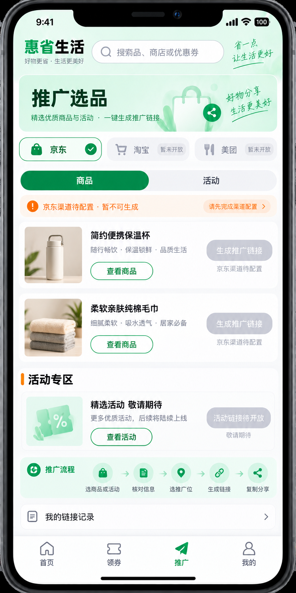
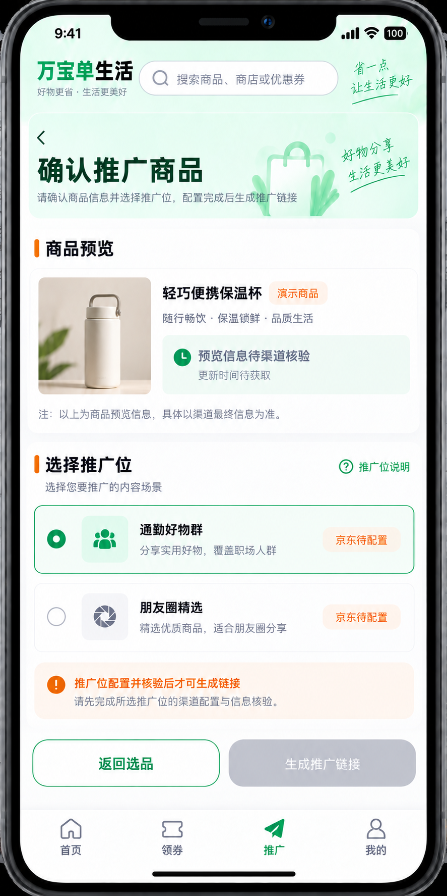
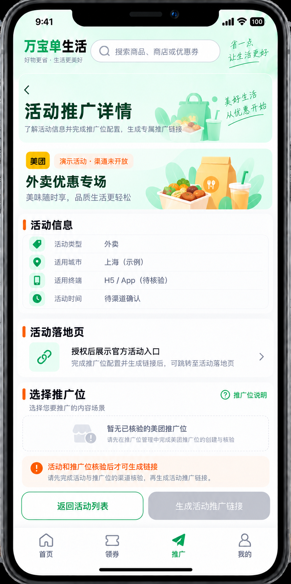
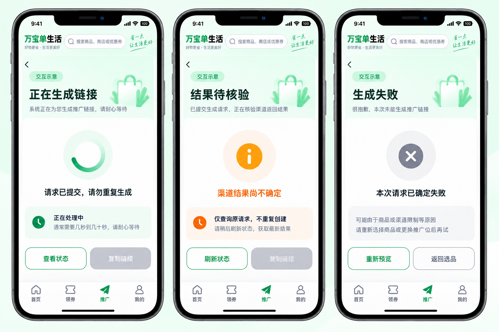

# V3 多平台商品与活动推广界面详细设计

日期：2026-09-17。状态：产品 / 技术设计，不代表淘宝、美团或京东真实转链已开放。入口从底栏「推广」进入，已启用推广身份后可查看[推广选品 V3 概念稿](./images/promotion-materials-h5-v3.png)。现有[推广中心首页](./images/promotion-center-h5-v3.png)展示的是「京东渠道待配置」状态；概念商品与活动不是生产目录。

## 1. 渠道能力与开放状态

| 平台 | 官方资料支持的物料方向 | 当前项目状态 | 界面处理 |
| --- | --- | --- | --- |
| 京东 | 官方[联盟接入说明](https://jos.jd.com/jdunion)列出网站 / APP 商品、活动链接转链及商品 / 券查询；[接口详情](https://union.jd.com/openplatform/api/v2?apiName=jd.union.open.promotion.common.get)需依实际账户权限核对 | 仓库只实现受控单品签名客户端和模拟契约；缺合规 siteId、AppKey/AppSecret、场景 2 及推广位真实核验，生产未装配 | 可展示候选商品与「渠道待配置」；禁用生成。活动目录和活动转链另验收 |
| 淘宝 | 官方开放平台有[商品链接转换](https://developer.alibaba.com/doc2/apiDetail.htm?apiId=24516)及[官方活动转链](https://developer.alibaba.com/docs/api.htm?apiId=48340)；不同推广者 / 服务商 API 与授权条件需逐项确认 | 本仓库无淘宝适配器、媒体 / 推广位、凭据或真实测试 | 平台可见但标「暂未开放」，不能把京东参数套用到淘宝链接 |
| 美团 | [美团联盟官网](https://union.meituan.com/)公开流程为登记媒体 / 推广位、选择活动获取推广链接，覆盖外卖、闪购、酒店等方向 | 本仓库无获批活动目录 / 取链接口、账号配置或真实测试；公开资料不足以证明任意商品直链可转 | 先以已授权活动卡为目标；任意商品链接推广保持关闭，等待具体业务 / 城市 / 终端授权 |

以上是官方文档层面的能力方向，不代表本账号获批。首期可交付范围仍是先验证京东单品；其他平台按渠道独立接入。图稿不得默认显示真实佣金、可生成状态或已成交订单。

## 2. 信息架构与页面

推广底栏 → 推广工作台（身份 / 渠道状态、默认推广位、订单与收益入口）→ 推广选品。选品页顶部先选「京东 / 淘宝 / 美团」，再选「商品 / 活动」；平台切换清空前一平台物料选择、预览与推广位，防止跨平台错配。每张卡只属于一个稳定物料 ID，独立展示类型、来源、商品 / 活动名称、有效期、渠道状态和操作：`查看`、`生成推广链接`。没有授权目录时显示空态和原因，不填演示商品。

| 页面 | 用户看到 / 操作 | 安全与业务边界 |
| --- | --- | --- |
| 商品卡 / 活动卡 | 每条独立「查看」与「生成」；活动卡有地域、终端、开始 / 结束时间 | 商品 ID 与活动 ID 不混用；美团活动范围按城市 / 业务配置 |
| 物料确认页 | 商品图、标题、实时价格 / 券、更新时间；或活动说明、时段、落地页类型 | 价格 / 收益仅在渠道报价可核实时展示为预计；活动不虚构商品价格 |
| 选择推广位 | 仅列当前用户、当前平台、当前场景可用的位；选择后展示渠道 readiness | 内部位存在不等于外部位 READY；服务端再次校验归属和资格 |
| 生成中 / 结果页 | PENDING / PROCESSING / QUERY_REQUIRED / SUCCEEDED / FAILED_FINAL；成功显示复制链接、复制公开文案、打开测试 | 未成功不能复制；结果未知查询原请求，不能盲目重发；不公开个人预计收益 |
| 链接记录 | 按平台、类型、推广位和时间查看本人历史；过期 / 活动下架标注状态 | 展示有效期结束不自动断言外部链接失效；本人历史停用后仍可读 |

商品确认与推广位选择的 V3 状态稿如下。示例商品仅用于布局，预览待渠道核验、京东位待配置时生成按钮保持禁用。

活动详情状态稿以美团外卖活动为示例。城市、终端和时段均需渠道核实；当前没有已核验活动或推广位，因此不开放生成。

用户提交转链请求后的三个非成功状态见下图：处理中只查询状态；渠道结果不确定只刷新原请求；确定失败后需要重新预览。三态都不显示可复制链接。

入口还支持「粘贴商品 / 活动链接」作为补充：先经服务端白名单安全识别并归一为已授权物料，不能把任意网页 URL 原样包装为推广链接。未识别或无权限显示原因，不创建 Tracking。手动输入与目录点选应汇入同一预览 / 生成链路。

## 3. 每个物料如何生成独立推广链接

1. 用户点某一 `materialId + materialType + platform` 的「生成」，前端先取最新详情；在界面上明确选择当前平台可用的 `positionId`，并确认投放场景。
2. 服务端验签用户、查推广资格与本人推广位 / 渠道映射 READY，读取物料当前版本、活动时效 / 地域及渠道报价；只读预览返回 `previewId`、规则版本、更新时间、过期时间和可展示的预计信息。不在预览阶段创建链接。
3. 用户确认后，以 `previewId + positionId + scene + Idempotency-Key` 发起生成。服务端二次核对同平台、同物料、同规则 / 价格和活动有效期，在事务里预留内部 `trackingId` 与转链请求；前端收到 202 仅表示处理中。
4. 渠道适配器用服务端持有的媒体、外部推广位、物料 ID / 原始获批链接和获批归因字段取链。`trackingId` 与渠道子标识的映射须在该渠道允许时才发送；不允许时不能谎称可精确到人归因。原始上游错误、签名和凭据不得展示或记录到公开日志。
5. 只有渠道确定返回可校验的安全目标 URL 后才归档 `SUCCEEDED` 并显示链接 / 公开文案。分享链接要么是已验证的渠道链接，要么是本站受控跳转地址，不接受客户端自填目标。每条不同商品 / 活动、推广位、场景生成独立记录；同一请求键同输入重放旧结果，不重复调用。
6. 渠道超时 / 不确定结果停在待核验，只按渠道支持的稳定请求号查询。若渠道无查询 / 幂等保证，保持人工核验或安全关闭，不能自动重发。复制成功仅代表本地复制，不代表分享送达、下单、归因或结算。

同一商品在两个推广位要有两条逻辑请求；同一个活动在不同城市 / 终端若使用不同渠道物料，也要分别生成。活动下架、券变化或预览到期要求重新预览并确认，不能沿用旧 `previewId`。消费者购物跳转与推广者生成分享链接分别使用权限及 Tracking 场景，不混用身份。

## 4. 平台适配与数据模型（目标，不是现有接口）

统一的内部物料：`platform`、`type=PRODUCT|ACTIVITY`、`externalMaterialId`、`canonicalUrl`（仅服务端）、`title`、`status`、`startsAt/endsAt`、`region`、`terminal`、`sourceUpdatedAt`、`ruleVersion`、`evidenceRef`。同一平台 `type + externalMaterialId` 唯一；卡片与结果均引用稳定内部 `materialId`。活动允许无商品价，但必须有时效与适用范围。

建议目标接口：`GET /api/v1/promoter/materials?platform=&type=&cursor=`、`GET /api/v1/promoter/materials/{id}`、`POST /api/v1/promotions/preview`（扩展为目录物料或受限输入）、`POST /api/v1/promotions/convert`、`GET /api/v1/promotions/convert/{id}`、`GET /api/v1/promotion-links`。前两项及列表为新增目标；已有预览 / 转链接口目前只覆盖京东商品边界，不能直接把活动 ID 塞入商品字段。扩展时保持历史请求兼容，并为商品 / 活动分别验证 schema、签名参数与返回链接。渠道适配器实现能力声明 `catalog / productPreview / productConvert / activityCatalog / activityConvert / resultQuery / attribution`，每项须以获批账户实测后才置 READY。

## 5. 验收与异常

- 京东单品、京东活动、淘宝商品、淘宝官方活动、美团授权活动分别独立验收；某一能力失败不影响已获批的其他能力。美团任意商品直链不列为默认验收能力。
- 会员未申请 / 审核中 / 拒绝 / 停用，位未配置 / 待核验 / 停用，活动未开始 / 过期 / 地域不符，商品下架、报价变化、预览过期、上游超时、结果未知、复制失败、链接展示过期、跨用户读取都要有明确状态和测试。
- 点击 / 分享事件与订单、预计收益、确认收益分层；真实测试订单须追溯物料、推广位、Tracking、渠道订单证据，不能仅凭分享时间和金额自动认领。
- 发布前核对渠道协议的允许媒体、投放域名 / APP、物料和用户归因字段，完成安全域名白名单、密钥管理、真实测试账户与端到端打开 / 回流证据。模拟接口与图稿只算设计 / 契约验证。
