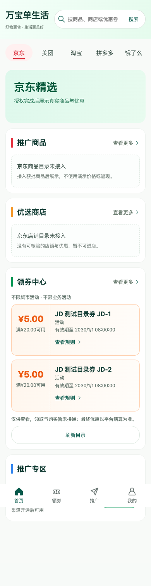
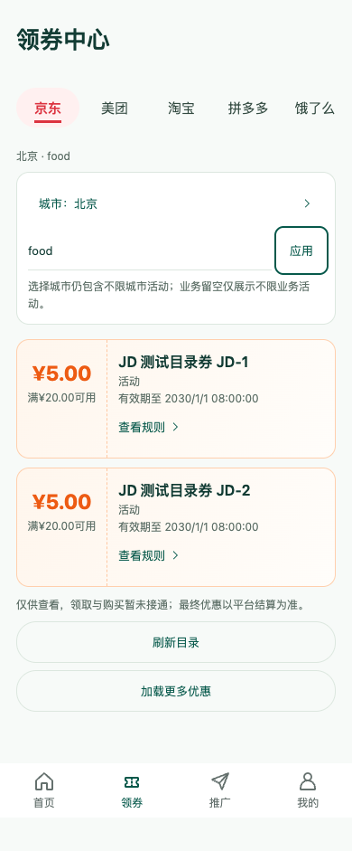

# GitHub 同步记录（2026-09-19）

任务：PROC-06。当前状态：PROC-06a 已完成，PROC-06b 等待远端推送与核对。

## 同步范围

- M1-01c（040dbd7）：V3 首页四模块、共享平台与首页 / 领券 / 推广 / 我的四栏导航。
- M1-01d-1（cc44882）：经完整响应校验的券目录 / 地域 / 详情只读 API 客户端。
- M1-01d-2（60c79e3）：首页券摘要、领券目录、地域 / 业务选择、规则详情、分页重试、旧响应保护及到期 / 失效隐藏。
- 已合并 origin/main 的 58b4549 基线，保留远端既有代码、文档和历史图稿；本次不强制覆盖远端。

## 图与研发对应

以下是实际页面截图，数据来自临时本机 HTTP 测试服务，不是真实渠道券，不可据此领券购买。

当前实现保留 V3 平台筛选、四栏导航、薄荷绿 / 白色 / 橙色券卡体系。与概念图的差异是有意的：未接入真实商品图片、分类精选和领取能力时，不展示虚构商品或「立即领取」；改为真实契约字段、地域 / 业务过滤与「查看规则」。旧 V1 / V2 图稿名称和演示金额仍作为历史归档，不逐张重绘。

## 验证及边界

功能提交前：109 项客户端测试、类型检查、H5 / 微信构建、Go 全量测试及 vet 均通过；浏览器 320 / 390 / 1280 屏宽检查通过，56 次只读无授权 HTTP 测试请求，刻意触发的 404 / 503 日志可解释，无其他运行错误。

合并后重新运行：客户端 109 项测试、类型检查、H5 / 微信构建、`go test -count=1 ./...`、`go vet ./...`、`go build ./...`、`node --test web/*.test.mjs` 13 项及 diff 检查全部通过；39 张 PNG 签名 / 非零尺寸与新增截图路径检查通过。远端核对待补。

未设置 PG_TEST_DSN，数据库集成跳过。生产部署、已有数据库迁移、真实渠道物料、真实身份、领券购买、资金业务及微信设备未验收。京东推广接口由另一 Codex 研发，本次不覆盖其工作。
