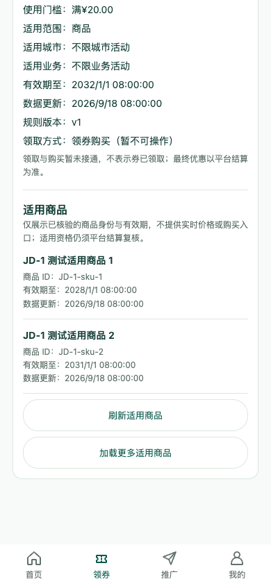
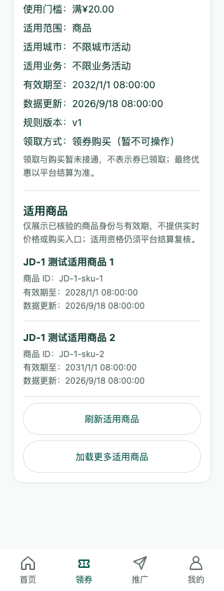

# GitHub 代码、文档与图同步（2026-09-19，第二轮）

任务：PROC-07。同步目标为 GitHub main，不是生产服务器部署。

## 本轮功能范围

- M6-02b-3a（287b08b）：适用商品只读 API 契约、分页与字段校验。
- M6-02b-3b（e7f9a3b）：券详情展示适用商品、分页重试、到期隐藏及旧响应保护。没有实时价格或购买入口，不表示领取成功。
- M3-02c-1（f270330）：本人推广订单列表 / 详情只读 API，显式注入身份，校验脱敏编号、归因、状态历史及分页；不包含收益金额。
- M3-02c-2a（f4ebb62）：推广订单状态模型，退出 / 换会话 / 401 清理缓存，筛选与详情响应隔离、分页保护、生命周期销毁。

已 fetch 并合并 origin/main 8e4edaa，结果 Already up to date。完整保留既有历史，不覆盖另一 Codex 的京东推广研发。推送与远端一致性由计划 PROC-07b 单独记录；本文件不把自身提交哈希循环写回。

## 当前实现与设计的区别

适用商品展示已落地，订单接口与模型已完成，但独立「本人推广订单」页面 M3-02c-2b 仍未开始；现有消费者订单页不能当成推广订单页面验收。真实身份、渠道物料、真实订单和资金链路仍未验收。旧 V1 / V2 与 V3 概念图继续保留，不把概念图当已实现功能。

## 实际 H5 图

截图来自本机临时 HTTP 测试服务，经真实 uni 请求和开发代理返回测试券与商品，非真实渠道数据，不可据此领取或购买。图为券详情滚动到适用商品区域后的实际视口。

## 重新验证

- 客户端 `npm test`：15 文件、217 项通过；`npm run typecheck`、`npm run build:h5`、`npm run build:mp-weixin` 通过。
- 后端 `go test -count=1 ./...`、`go vet ./...`、`go build ./...` 通过；`node --test web/*.test.mjs` 13 项通过。
- Browser plugin not available，使用已有 Playwright / Chrome，无新安装依赖。验证地址 `http://127.0.0.1:5173/#/pages/coupons/index`，屏宽 320 / 390 / 1280，高 844。
- 页面标题正确、非空白、无框架覆盖或横向溢出；51 次 GET 测试请求均无授权头。刻意触发的 9 条 404 / 503 资源日志符合测试，无其他运行错误。
- 交互：查看规则 → 适用商品 → 键盘分页 / 重试 / 关闭；验证空态、失败重试、到期隐藏、关闭或切平台后的旧响应不恢复、券撤销后隐藏、开发代理拒绝领券写入及推广请求。
- 直接检查 390px 和 320px 截图，文字与按钮可读，底栏无覆盖适用商品内容。图路径、PNG 签名与非零尺寸及 `git diff --check` 单独复核。

未设置 PG_TEST_DSN，数据库集成测试跳过；没有运行生产迁移、真实登录、真实京东 / 淘宝 / 美团渠道业务、微信真机或资金验收。构建链既有审计风险仍由 M0-02e 跟踪，不代表生产安全发布门槛通过。
