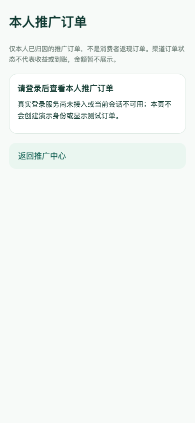
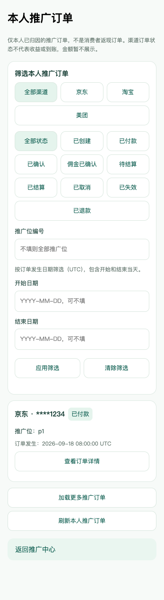
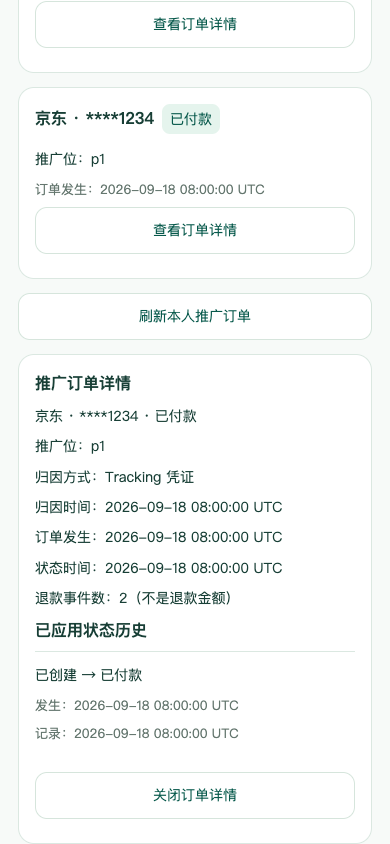

# 当前代码、文档与页面图同步（2026-09-19，第三轮）

任务 PROC-08；目标为 GitHub main，非生产网站部署。

## 本轮已验收范围

- M3-02c-2b（e9a063f）：独立本人推广订单页，渠道 / 状态 / 推广位 / UTC 自然日筛选、分页与详情、失败重试、退出和换身份隔离。消费者订单页保持独立，不显示收益金额。
- M3-04a-1（f0c2a28）：看板 HTTP 时间统一 UTC 序列化，保留上海自然日统计与历史时区的真实时刻。
- M3-04b-1（e44e9b7）：本人看板只读 API 契约、身份隔离、时间与计数字段校验。
- M3-04b-2a（197df54）：看板状态模型、筛选及快照失效保护、退出 / 换身份 / 401 清理与销毁。

独立看板页面 M3-04b-2b 的未验收组件与测试不纳入本次发布；不能把接口 / 模型当成已完成页面。详细状态以[研发计划](./superpowers/plans/2026-09-16-promotion-center.md)为准。本文件取代上一轮同步记录的当前状态，旧记录保留为历史。

## 实际页面图

以上为真实 H5 页面 390px 截图；列表与详情仅由 QA 注入测试身份及拦截 HTTP 返回本机测试数据，不是生产身份或真实渠道订单，不修改产品身份入口。未登录默认不发推广订单请求。历史 V2 / V3 概念图保留，不以截图冒充重绘图稿。

## 本轮复验

在独立工作树复验已提交代码：客户端 `npm test` 19 文件 316 项、`npm run typecheck`、`npm run build:h5`、`npm run build:mp-weixin`；服务端 `go test -count=1 ./...`、`go vet ./...`、`go build ./...`；`node --test web/*.test.mjs` 13 项均通过。

现有 Playwright / Chrome 复验 320 / 390 / 1280px 的实际路由、键盘入口、默认未登录零请求、筛选 / 非法日期、分页和详情重试、空态、退出后旧响应及 401 清理；39 次只读请求，9 条预期 HTTP 错误，无其他运行错误，无溢出或覆盖。图片及本次文档链接另行检查。

PG_TEST_DSN 未配置，数据库集成跳过。真实身份、渠道、订单、收益结算及微信真机验收仍待进行；构建链安全问题仍按 M0-02e 跟踪。本轮不操作生产服务器或数据库。

## 合并与同步

fetch / merge origin/main 815172d，Already up to date；当前四项任务为其后继提交。HTTPS 推送因缺少本机认证失败，改用既有 SSH 身份非强制推送 main 至 ce8e516，重新 fetch 后确认 HEAD 与 origin/main 一致。核对记录另由 PROC-08b 提交；保留另一 Codex 与远端既有历史，未完成工作和 .DS_Store 保留在原工作区，不暂存。
