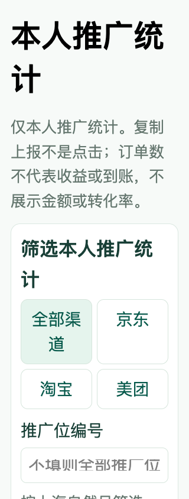
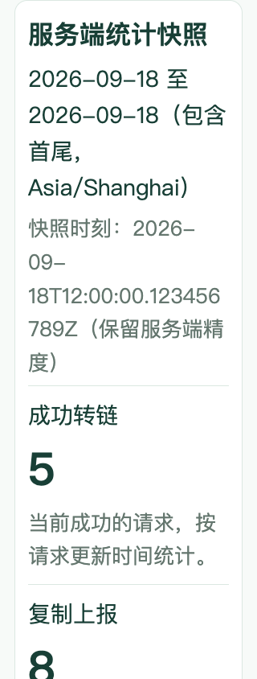
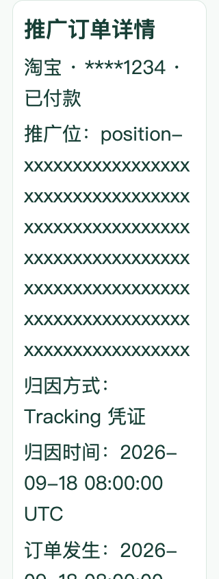

# 2026-09-19 代码、文档与实际页面图同步

任务：PROC-09。同步目标为 GitHub `main`，不等于生产部署。

## 本次范围

- M3-04b-2b-1 / M3-04b-2b-2：独立本人推广统计页面和组件，按平台、推广位、日期筛选，只展示链接、复制上报和有效订单计数，不冒充收益或点击统计。
- M3-05a：订单异常验收证据与缺口审计。
- REL-01a-1：转链输入清空旧原生值、保留无障碍标签。
- REL-01a-2：首页大字号下搜索区域宽度与输入高度修复。
- REL-01a-3a：本人推广订单 / 统计筛选输入大字号裁切修复与真实浏览器回归。

从 origin/main `c06ff30` 快进合并至 `ef0e98d`，远端合并返回 Already up to date。未纳入 REL-01a-3b 尚未完成的券 / 商品字体验收；原工作区修改保留。

## 验证与边界

2026-09-19 复验：客户端 `npm test` 21 文件 / 336 项，`npm run typecheck`、`npm run build:h5`、`npm run build:mp-weixin`；`npm run test:layout` 3 项，320 / 390 / 1280px；后端 `go test -count=1 ./...`、`go vet ./...`、`go build ./...`；原生 H5 `node --test web/*.test.mjs` 13 项，全部命令退出 0。

浏览器测试使用已安装 Chrome / Playwright、127.0.0.1:5173 实际 Vue 页面和 uni 请求，测试端提供合成身份并拦截只读 HTTP。200% 为 CSS 文本放大，不是系统字体、全页缩放或正式无障碍认证。统计截图来自本机测试数据，不是生产订单、真实身份或渠道收益。

PG_TEST_DSN 未配置，数据库依赖集成测试跳过，不将 Go 命令通过描述为真实数据库验收。真实渠道、身份、财务与微信真机仍按研发计划跟踪；未执行迁移或部署。

## 更新的实际页面图

以下为 320px 大字号状态，截图不含真实账户或渠道凭据。既有 V2 / V3 概念稿继续保留，不重绘成“已实现”。

其余输入 / 筛选截图见图片目录索引；远端同步结果单独记录于 PROC-09b。
