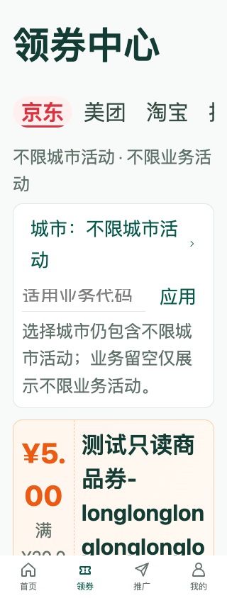
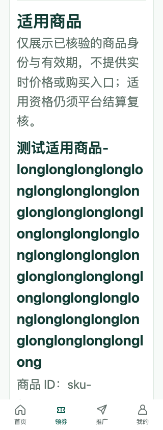
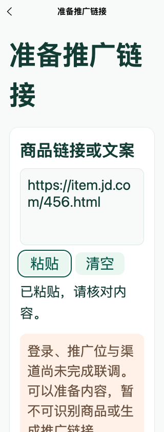
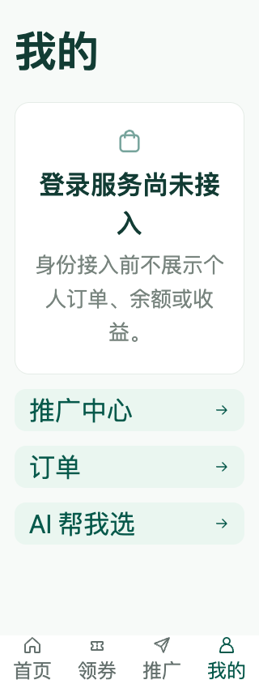
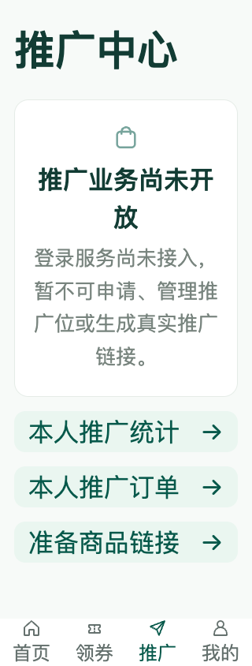

# 2026-09-19 物料模型、页面验收与图同步

任务：PROC-10。目标是 GitHub main 源码、文档和实际页面图，不是生产部署。

## 同步范围

### PROC-16 增量同步（2026-09-19）

整合4个已完成任务：M7-01d-3b-1受控绑定解析（c6f95ee）、M7-01d-3b-2启动配置加载（39689d9）、M7-01e-1安全选品API客户端（af6650c）、M7-01e-2选品状态与撤销隔离（06eef4b）。部署说明、测试计划、架构与任务计划随代码同步。选品页面M7-01e-3尚未完成；目录读取不授权生成推广链接，现有京东适配器未改动。

客户端23文件417项测试、类型检查、H5 / 微信构建及本机Chrome / Playwright浏览器7项、原生H5 13项通过；55张PNG签名 / 非零尺寸、6个相关文档27条相对链接检查通过。无页面视觉变更，保留V2 / V3设计稿及实际截图，不新增虚构页面图。生产发布入口仍未提供，本次目标仅GitHub源码同步，不部署应用或迁移生产数据库。

后端首次并行全量测试在TestClaimReserveIsolationAndOutcomes出现coupon_claims_pkey冲突，第二次临时API启动5秒超时；本轮未改动领券代码。独立连续5次领券定向复测及私有PG_TEST_DSN下`go test -p 1 -count=1 ./...`串行全量、`go vet ./...`、`go build ./...`退出0。发布工作树已快进至06eef4b，tracked树一致。保留失败记录，不将复测通过等同于已修复间歇性并发或启动风险；后续需独立跟踪。推送结果见计划PROC-16b。

### PROC-15 增量同步（2026-09-19）

本轮整合M7-01d-1物料详情（92f4b1c）、M7-01d-2a服务端可信媒体绑定（59250b1）、M7-01d-2b鉴权只读列表 / 详情HTTP接口（5669614）、M7-01d-3a应用运行时接入及真实签名HTTP / 隔离数据库验收（40770b9）。相关接口、测试、部署边界、架构与计划文档随代码同步。CATALOG读取不授权链接生成；cmd/api受控配置加载M7-01d-3b、选品前端M7-01e及真实渠道验收仍未完成，默认空绑定保持拒绝。

原分支使用私有PG_TEST_DSN全量Go test / vet / build退出0；客户端21文件338项、类型检查、H5 / 微信构建、Chrome / Playwright浏览器7项及原生H5 13项通过。Browser插件不可用，使用README指定已有Playwright / Chrome，在127.0.0.1:5173回归七个已实现页面的320 / 390 / 1280px及CSS文本放大、筛选、分页、错误恢复和键盘行为。55张PNG签名与非零尺寸、27个相关文档相对链接通过。

没有视觉改动，现有V2 / V3设计稿与实际截图继续保留，不新增虚构页面图。发布工作树快进合并已完成提交，合并树复验及推送核对记录见计划PROC-15。仓库没有生产发布入口，本轮只更新GitHub源码、文档和图，不执行生产部署、业务库迁移或真实渠道调用。

### PROC-14 增量同步（2026-09-19）

新增本人范围能力读取（61bcd38）、同一只读快照的授权物料目录及安全分页（1bb9da7）、完整23项迁移逆序down与重应用验收（bbd949a）、目录跨批与撤销变更的实际并发快照测试（1ed83c3）。M7-01c按限定仓储 / 数据库范围已完成；M7-01d鉴权列表 / 详情API、M7-01e选品前端、真实渠道来源和生成授权复核尚未完成。CATALOG允许读取不是推广链接生成权限，京东适配器未改动。

原分支和发布快进合并树均配置私有PG_TEST_DSN，全量Go test / vet / build退出0；客户端338项、类型检查、H5 / 微信构建及Chrome布局7项通过，原生H5 13项通过；55张归档PNG与11个相关文档相对链接检查通过。浏览器首次缺已有模块路径未启动，指定README运行配置后重新通过；不把首次失败或此前历史跳过记录当作成功。

本次只有后端及文档增量，没有页面视觉变化，下方实际页面图和现有V2 / V3设计稿继续沿用，不伪造新实现截图。生产部署入口仍未提供，未连接业务数据库、未执行生产迁移或上线。GitHub推送及远端核对结果见研发计划PROC-14b。

PROC-14b结果：SSH非强制推送main成功，重新fetch后发布HEAD与FETCH_HEAD均为439ba833f730b67d1235b5746c719818a151f229。结果记录另行提交同步，避免自身哈希循环更新。

### PROC-13 增量同步（2026-09-19）

新增物料查询与owner / scope绑定分页（b244556）、物料表与真实约束测试（663ffb5）、私有PostgreSQL实跑记录（ef95b2a）、tracking测试清理修复（47e78fe）、能力表与不可变证据（a32f61a）。能力证据UPDATE / DELETE / TRUNCATE拒绝，READY只能引用本声明证据；数据库结构不等于来源授权或真实业务验收。发布工作树已快进整合远端main；推送结果在计划PROC-13记录。

本增量没有前端视觉变更，沿用下方实际页面截图和图册的V2 / V3设计稿，不生成与实际不符的新图。原PROC-10“数据库跳过”是历史记录，本次已使用私有PG_TEST_DSN执行真实数据库测试。后续物料仓储 / API / 选品页面和真实渠道验收未完成。

部署检查：deploy/compose.yaml仅提供本机测试PostgreSQL；仓库未提供生产主机、发布流水线或可执行生产部署入口。因此本次更新GitHub源码及相关文档 / 图，不代表线上应用已发布，也没有执行生产数据库迁移。

- REL-01a-3b-1 / 3b-2：券业务筛选采用最新原生输入值，券和适用商品的大字号、键盘、分页与错误恢复回归。
- REL-01a-4 / 5：转链准备输入和剪贴板状态回归、七个已实现页面的三种宽度验收。仅本机已实现范围，不代表全部设计页面或真实终端验收。
- M7-01a（3c6c1fc）：可信能力声明领域判定，平台 / 类型 / 媒体 / 位 / 场景 / 终端 / 地域 / 业务精确匹配，缺少完整有效证据拒绝。
- M7-01b（4356918）：商品 / 活动身份与范围模型、安全卡片投影、JSON 时间边界；不公开内部 URL 或证据、不把活动当商品 SKU。

2026-09-19 fetch 远端 main 后无远端独有提交，已完成提交可快进整合。再次合并和推送结果由 PROC-10b 独立记录。

PROC-10b结果：再次 fetch / merge main 返回 Already up to date，发布工作树快进合并 584deca→697fb15；SSH 非强制推送 main 成功。重新 fetch 后 HEAD / FETCH_HEAD 完整哈希一致：697fb157b20389234f74c594b15884e9173c3ecd。本结果记录独立提交并同步，不将本记录自身哈希循环写入文档。

## 验证

- `go test -count=1 ./...`、`go vet ./...`、`go build ./...`：退出0。
- 客户端 `npm test`：21文件 / 338项通过；`npm run typecheck`、`npm run build:h5`、`npm run build:mp-weixin`：退出0。
- `npm run test:layout`：7项通过，Chrome / Playwright，127.0.0.1:5173 实际 Vue 页面，320 / 390 / 1280px。200% 是 CSS 文本放大，不是系统字体或正式无障碍认证。
- `node --test web/*.test.mjs`：13项通过。归档图片非零尺寸，文档相对链接及 diff 检查通过。

PG_TEST_DSN 未配置，数据库依赖用例跳过，不构成真实数据库验收。物料目录仓储 / API / 选品页面及真实渠道来源验收仍待后续 M7-01c～f；领域判定通过不意味着能生成推广链接。现有京东适配器未更改。未运行生产迁移或部署，未开启未获批渠道。

## 实际页面图

以下为本机320px / 200% CSS文本截图，券与商品使用合成 HTTP 测试数据，不是线上可领取商品；输入链接也为测试值，无真实身份、订单、凭据或收益。保留原 V2 / V3 概念稿，不将设计稿重标为已实现。

