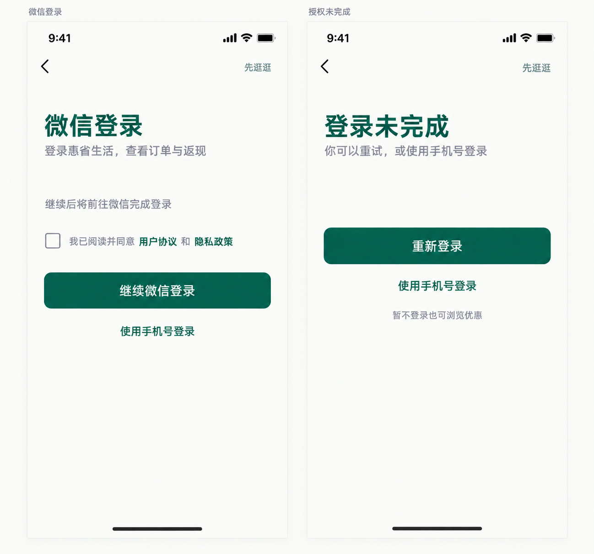

# 简化版登录配套页面 V3



配合 [手机号登录页 V3](./user-ui-login-simple-v3.png)，补齐微信登录入口及登录未完成后的恢复页面。每页保留一个主要按钮、手机号登录链接与游客入口，移除装饰插画、宣传口号和权限说明卡片。

微信页为应用内登录入口示意，实际微信授权交互由接入环境决定；如前序页面已完成协议确认，不重复要求勾选。失败页允许重试或切换登录方式，不把取消授权视为必须阻断浏览的错误。

使用内置 imagegen，V3 手机号登录页作为风格参考。已目视检查两屏标题、操作入口及整体风格。设计为概念稿。

## 完整提示词

```text
Use case: ui-mockup.
Input image 1: STYLE REFERENCE ONLY. Extend the extremely simplified 惠省生活 V3 login design into TWO companion screens. Create one high resolution board containing exactly two complete vertical mobile screens side by side, each logical 390x844, thin neutral gutter, narrow board margins. No bulky phone hardware. Small unobtrusive caption ABOVE each screen: "微信登录" and "授权未完成"; no big presentation header. Match reference warm off-white #FAFBF8, deep emerald #075E46, muted gray, Chinese sans serif type, rounded 12px buttons, 28px logical side padding. Large calm whitespace. No gradients, waves, plants, mascots, illustrations, official logos, security badges, marketing slogans, secondary permission cards, or bottom navigation. Native 9:41 status bar and bottom home indicator each.
LEFT screen: app-owned WeChat login entry screen, not an imitation of WeChat's native permission dialog. Top left small back arrow, top right muted "先逛逛". At about 18% screen height left aligned title "微信登录" in 28px dark emerald semibold. Short gray line "登录惠省生活，查看订单与返现". Then modest 36px spacing. One subtle sentence "继续后将前往微信完成登录". Below, unchecked checkbox with short "我已阅读并同意" and linked "用户协议" "隐私政策", fit two lines if needed. One full width solid emerald primary action "继续微信登录", height 52px. Underneath a simple centered text link "使用手机号登录", not a second outlined full-width button. Leave remainder clean whitespace. Do not request nickname/avatar permissions or display a permissions checklist.
RIGHT screen: login not completed, top left small back arrow, top right "先逛逛". Same left-aligned title position and type "登录未完成". Short gray text in two lines "你可以重试，或使用手机号登录". 36px gap. One full-width solid emerald primary action "重新登录". Then centered text link "使用手机号登录". Below in small gray "暂不登录也可浏览优惠". No warning symbol, no dramatic error illustration, no explanations about technical errors, no extra consent checkbox on this recovery screen. Primary button and secondary link have consistent sizes/styles with left.
Constraints: exactly two screens, all listed text legible in simplified Chinese, no additional invented text. Clear hierarchy, keep content in upper-middle region with breathable spacing. Minimal mobile UI, every element has a purpose.
```

