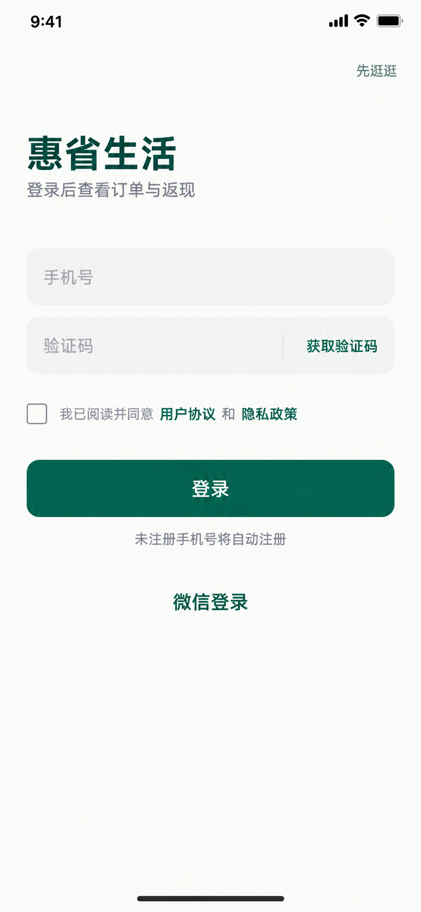

# 登录页简化版 V3



本版取代 V2 三屏图中的手机号登录页作为最新视觉方案；微信登录与失败页见 [简化版配套两屏 V3](./user-ui-auth-companion-simple-v3.png)。

保留品牌、手机号、验证码、登录按钮、未勾选协议、微信登录和游客入口。移除重复欢迎标题、宣传口号、背景装饰、输入框图标及第二个大按钮。合并登录与注册入口；注册说明位于主按钮下方。

这是界面概念稿。开发时手机号与验证码需要校验；获取验证码应有倒计时、提交应有加载态，错误提示就近显示。

## 完整提示词

使用内置 imagegen，对 V2 手机号登录界面进行简化重绘。

```text
Use case: ui-mockup / precise-object-edit.
Input image 1 is the existing three-screen authentication UI board. Redesign ONLY its first phone login screen into a substantially SIMPLER refined mobile login interface for 惠省生活. Output ONE standalone portrait mobile screen (not the three-screen board), high resolution, logical proportions 390 x 844. Full screen edge to edge, no phone hardware, no external presentation title or captions.
Keep the brand deep emerald #075E46, warm white #FAFBF8, clean Chinese sans serif. Flat solid colors. Large calm whitespace, generous 28px horizontal padding, exquisite typography and precise alignment. Remove all decorative background waves, leaves, gradients, slogans, illustrations, duplicate branding, oversized icons, and divider labelled other methods.
Layout from top:
- Small native status bar 9:41.
- Top-right small text button "先逛逛" in muted gray-green.
- At approximately 18% screen height, simple left-aligned brand title "惠省生活" in deep emerald 28px semibold, below small gray "登录后查看订单与返现". No separate logo icon, no 欢迎回来 title.
- Spacing 36px, two clean rounded light-gray filled input rows, each 54 logical pixels high, radius 12px, 12px gap. First placeholder "手机号", no decorative phone icon. Second placeholder "验证码", right-side text action "获取验证码" in emerald separated by subtle short vertical divider.
- Below fields, unchecked small square checkbox with readable muted text "我已阅读并同意" then links "用户协议" and "隐私政策" in emerald, allow two neat lines if needed. No prechecked consent.
- 18px below, one full-width solid emerald rounded primary button "登录", white 17px semibold, height 52px, no shadow and no gradient.
- Small subdued explanatory text directly underneath "未注册手机号将自动注册".
- 28px below primary button: a compact centered text button "微信登录" in emerald; do not use a second full-width button or a giant official icon.
- Rest of screen intentionally calm empty warm-white space. Small home indicator at bottom only, no footer slogan.
Constraints: show ONLY the listed UI text, no extra marketing copy, no surrounding board, no extra screens, no duplicated titles, no illustrations or unnecessary icons, clean legible Chinese. This should feel like a minimal production-quality login screen matching the established app's typography and emerald color.
```
